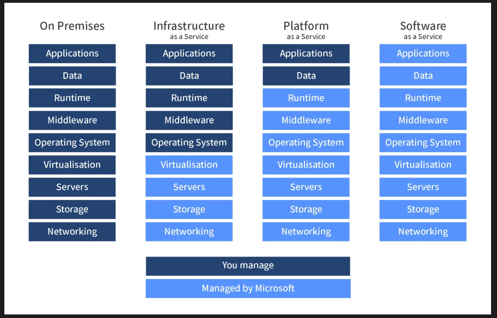

# Understanding: What is Cloud?

- [Understanding: What is Cloud?](#understanding-what-is-cloud)

Research: 

- How do we know if something is in the cloud? Differences between on-prem and the cloud? 
  
*on-premises means your infrastructure is based on your local machine, in your own data center. You are responsible for your infrastructure*

*when on cloud means you rent servers, storage and applications from third-party providers (e.g., AWS & Azure), centrally managed*

- The 4 deployment models of cloud: private vs public vs hybrid vs multi-cloud - Differences? How do they work? 

*Private Cloud: Infrastructure is used exclusively by one organization. It offers greater control over security and data but requires more resources to maintain. Can be run without internet connection.*

*Public Cloud: Services are delivered over the internet and shared among multiple customers (e.g., AWS, Azure). It’s cost-effective and scalable but offers less control over data.*

*Hybrid Cloud: Combines both on-prem and public cloud environments, allowing businesses to maintain sensitive data on-premise (particularly in industries that are regulated) while leveraging the scalability of the public cloud for other operations.*

*Multi-Cloud: Uses multiple public cloud providers to avoid dependency on a single vendor. This approach offers flexibility but adds complexity in managing multiple platforms​(Software Connect).*

*why use multi-cloud? cost can be an impact but different cloud providers have different strengths* 

- Types of cloud services: IaaS, PaaS, SaaS - What are differences? 
`What are the advantages/disadvantages of the cloud? (Particularly for a business) 

*IaaS (Infrastructure as a Service): Provides virtualized computing resources (servers, storage) over the internet. It allows businesses to avoid the costs of purchasing and managing physical infrastructure.*

*PaaS (Platform as a Service): Provides a platform for developers to build, test, and deploy applications without worrying about the underlying infrastructure.*

*SaaS (Software as a Service): Delivers software applications over the internet on a subscription basis (e.g., Google Workspace, Salesforce), simplifying updates and accessibility*

*The advantages include saved costs when it comes to hardware, scalability and the cloud providers maintain the hardware and IT operations like patches, back ups and updates*

*Disadvantages include dependence on internet connectivity, downtime can be a disadvantage bu it could be due to your code*

  - Difference between OpEx vs CapEx and how it relates the cloud 
  
*CapEx (Capital Expenditure) involves large upfront investments in physical infrastructure (e.g., servers, data centers). On-prem solutions typically follow this model.*

*OpEx (Operational Expenditure) in the cloud refers to the pay-as-you-go model where you only pay for the resources used, making budgeting more flexible.*

  - Is migrating to the cloud always cheaper? 

*Migrating may not always be cheaper*
*initial savings can be made bc there is no need to invest in physical infrastructure*

*However organizations have to keep paying for what they use on a constant basis as there are subscription services (Saas, PaaS or IaaS)*

- Marketshare - What is the breakdown? Add a diagram to help understand marketshare trends 

  - What are the 3 largest Cloud providers known for (What makes them popular?) 

*Amazon Web Services (AWS): Known for its vast ecosystem of cloud services and global data centers. Cheapest of the big three, smaller providers are cheaper but will likely have less range*

*Microsoft Azure: Popular for its integration with Microsoft tools and strong hybrid cloud offerings.*

*Google Cloud Platform (GCP): Recognized for its data analytics and machine learning capabilities​. Being good at it makes you unique in the job market. Particularly for google APIs (yt or google maps or google translate)*

- Which cloud provider do you think might be the best? Why? 
  
*AWS because they were the first major cloud provider and they offer a large range of services ( compute, storage, databases, machine learning, artificial intelligence, analytics, Internet of Things (IoT)).*

*They have a global infrastructure across 30+ geographic regions*

*AWS is very scalable,  allowing businesses to quickly adjust resources based on demand.* 

- What sorts of things do you usually need to pay for when using the cloud? 

*Compute Resources: (VMs), serverless computing, containers*

*Storage: Block Storage, Object Storage, Data Backup and Archival*

*Networking*

*Database Services*

*Content Delivery Network (CDN)*

*AI and Machine Learning Services*

*Monitoring and Management Tools*

*Security and Compliance*

*Developer and Integration Tools*

*egress, the data going out of your network*

*public IP addresses*

- What are the 4 pillars of DevOps? How do they link into the Cloud? 

*Culture and Collaboration*

*Automation and Tooling*

*Monitoring and feedback*

*Continuous Learning and Improvement*

If time... 

- Find up to 3 case studies showing how businesses have migrated to the cloud or used the cloud to improve in some way 
- In the README.md, add + personalise the content with your own comments, "take-aways", things you've learnt. Supplement the content with extra research where you feel your understanding is weaker. 
- Understand the content so you are ready to be asked interview questions on the topic 

 

Post a link to your repo in chat repo by COB

 

