add a auto table of contents = "ctrl shift p" to add a command to vsc and search "create table of contents"


- [Rules for Cloud](#rules-for-cloud)
- [Azure VM labelled diagram](#azure-vm-labelled-diagram)
- [Create an Azure test VNet](#create-an-azure-test-vnet)
- [To delete a Azure VNet](#to-delete-a-azure-vnet)
- [To delete a VM](#to-delete-a-vm)
- [Make our actual VNet](#make-our-actual-vnet)
- [Create a ssh key pair](#create-a-ssh-key-pair)
- [Considerations for creating a VM - Create a plan](#considerations-for-creating-a-vm---create-a-plan)
- [Creating a Virtual Machine](#creating-a-virtual-machine)
- [Stop a VM](#stop-a-vm)
- [Log into your VM (WITH NO PATH)](#log-into-your-vm-with-no-path)
- [With a path (will find the key from any folder in your home direc)](#with-a-path-will-find-the-key-from-any-folder-in-your-home-direc)


## Rules for Cloud
- On Azure
  - on make what you are authorized to make
  - Tag everything with a key- pair value "Owner: *first name*"
    - billing is linked to the owner tag
    - in the meta data so you can easier find things and keep them organised
  - Any .pem files (a private key, must be kept private- private keys can also have no extension) must go in your .ssh folder (a hidden folder w all out ssh keys). 
    - Must NEVER be put on a GIT repo- Never GIT initialized.
    - Contains credentials that would allow others to access ur local pc.
  - Use UK south region only
  - Working hours for Azure or AWS is 9-5pm.
    - Must let Ramon know by 4:30 to extend to 6pm.
  - switch off "stop" VMs when not using them after hours.
  - It is your responsibility to remove anything you don't need anymore.

- On AWS
  - Same as above BUT you don't need to tag ownership
  - Choose the ireland region
 
DO NOT EVER EXPOSE YOUR CREDENTIALS:
- GITHUB
- teams screen sharing 
- AWS/Azure
- uploading content to teams
- etc

## Azure VM labelled diagram
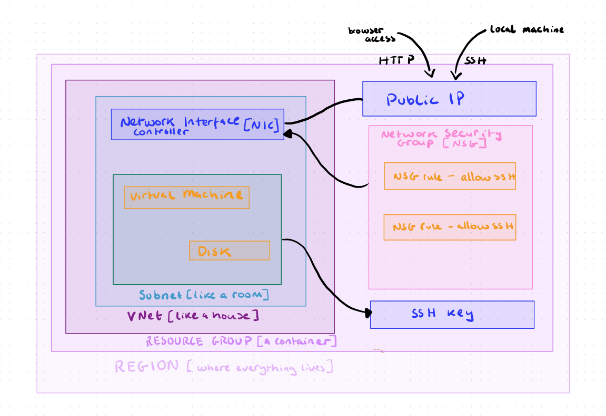


## Create an Azure test VNet
1. search "virtual network" on Azure
2. click create
   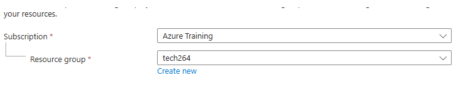
4. we only have access to "tech264"
5. name using a naming convention, must have "tech264-anjy"
   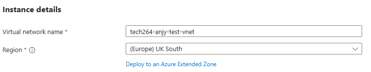
6. put your owner tag as a key
   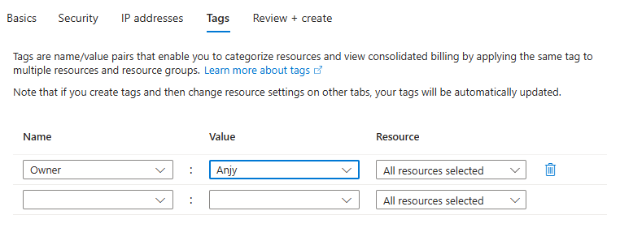
7. then review + create
8. when deployment completes
9. it only created on resource but can make more
10. go to resource
11. shows the details of the VNet


## To delete a Azure VNet
1. search resource groups
2. you can see everything in the resource group
3. click into it and select the VNet you want to delete
4. click the three dots to the right at the top and confirm delete, NOT delete resource group

## To delete a VM
   1. If you click onto ur VM and click delete, it will also delete the network interface card and the IP address
   2. the better way, got to resource group on Azure
   3. click the things you don't want to reuse
   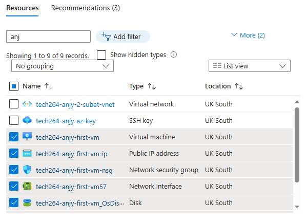
   -   you can reuse the public IP
  4. Click delete, tick the box and confirm delete.

## Make our actual VNet 
- a virtual machine is like a computer but in the cloud - we want to run linux from our local machines
- a VM must fit into a subnet within our VNet
  
- the VNet (tech264-anjy-2-subnet-vnet) CIDR block is 10.0.0.0/16 (gives 65k addresses)
- make two subnets 
  - public (anyone can access)
    - CIDR block 10.0.2.0/24
      -  Represents a range of IP addresses
      -  256 possible addresses in this space
  - private (later will have security) 
    - CIDR block 10.0.3.0/24
-  adjust CIDR blocks
   
-  make sure to change the starting address and only the IPv4
  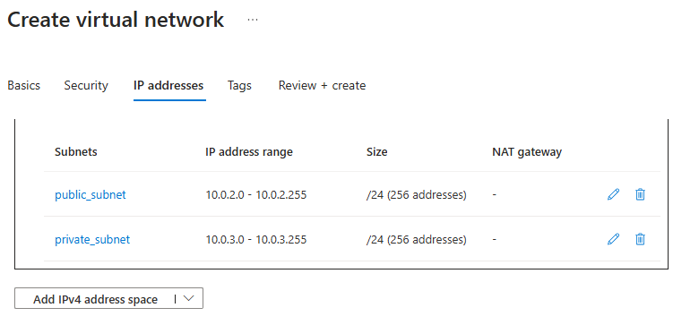
- add the owner tag

## Create a ssh key pair
can be done by Azure or AWS but must know manually- used to log into your virtual machine

MUST BE PRIVATE - private "key" on local machine and public "padlock" on azure

1. open git bash
2. be in your home dirc (c/user/aogunwoolu)
3. store ```.ssh``` here
4. ```mkdir .ssh```
5. cd into your ```.ssh`` folder
6. ```ssh-keygen -t rsa -b 4096 -C "your email address"```
   -  -t= type generates a rsa key,
   -  -b = bytes 4096 the bytes of the key
   -  -c = owner
7. hit enter and name it ```tech264-anjy-az-key```
8. hit enter- no pass phrase 
9. also makes a .pub extension, can see when you ls
10. ``` cat tech264-anjy-az-key.pub``` use this command to open the public key
11. print and copy onto azure
12. search ssh keys 
13. name it the same as what it is on the local machine "tech264-anjy-az-key"
14. copy the EXACT key, from first to last charc, must start with "ssh-rsa" and end with your email
15. tag name as owner
16. click create
    

## Considerations for creating a VM - Create a plan

Consider price (some check options aren't necessarily what you need or want)

1. What virtual network and what subnet- create and set up pre creating a VM
2. Naming convention
3. Location and pricing 
   - you want the region you choose to be close to your users
   - some locations cost more in other countries than others
4. Size and pricing 
5. Storage and pricing
6. Operating sys and pricing (some are open source)
7. Set up and access ssh key pair
   -  Does everyone in the team have access?
   -  Will everyone have their own key and padlock?
8. Back systems?
   


## Creating a Virtual Machine

The API  (ARM) running behind Azure (carries out of the services).

1. search for VM of the Azure webpage
2. create and click Azure virtual machine
3. select subscription and resource group like before
4. name following the conventions
5. Region is Uk south
6. availability zone (it will choose for you): 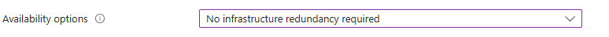
7. security type - change to standard
8. images (a snap shot of set of files from your hard drive, inc an os)
    - choose ubuntu 22.02 
9. Leave VM arch. as x64
size as follows
1.  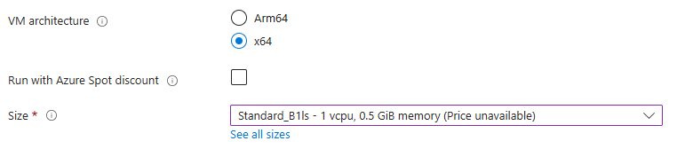
2.  fill admin account section as follows:
    - use a ssh public key
    - change default username to adminuser
    - use existing key
    - selected stored key
  
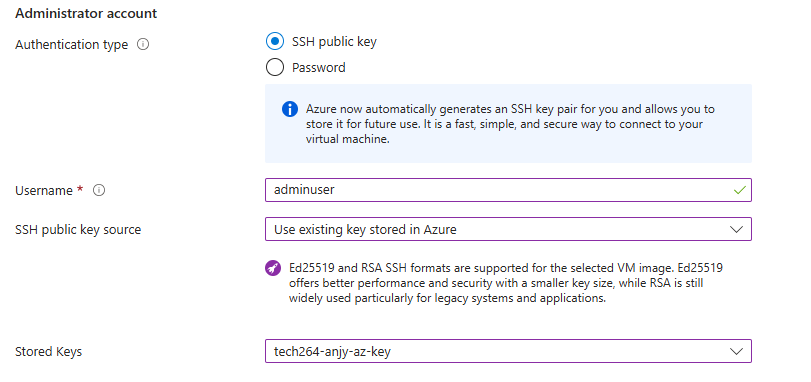
12.  choose http and ssh as inbound ports: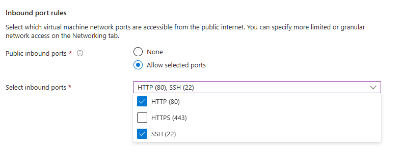
13. next onto discs tab, choose standard ssd
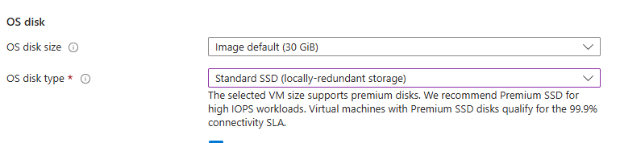
14. next onto networking

15. select your VNet
16. select your subnet (public)
17. leave public IP and NIC unedited. The page should look as follows:
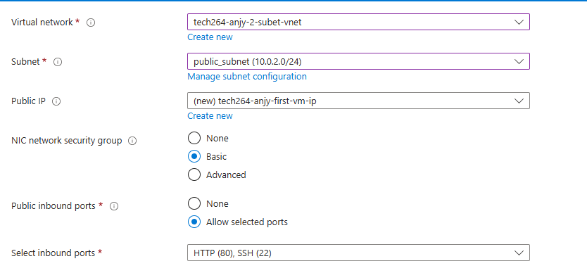 
1.  select "Delete public IP and NIC when VM is delete" 
2.  skip tabs until tags
3.  Set you owner kay with your name
4.  click create

## Stop a VM
1. find and click on your VM
2. check the status and click stop at the top
3. click yes on the pop up

## Log into your VM (WITH NO PATH)
1. click connect on your VM
2. COnnect using "Native ssh"
3. at the 3rd prompt "Copy and execute SSH command"
4. add the name of your private key - "tech264-anjy-az-key"
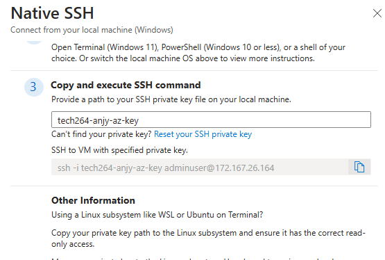
5. copy the command
6. paste into git bash WITHIN the ```.ssh``` direc
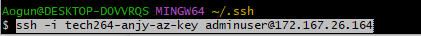
7. prompts to ask if you are sure you want to connect to this IP address - "yes"  
8. you are now logged into the home direc of the adminuser that you are logged in as
9. if logged into the virtual machine successfully, the git bash should display the following:
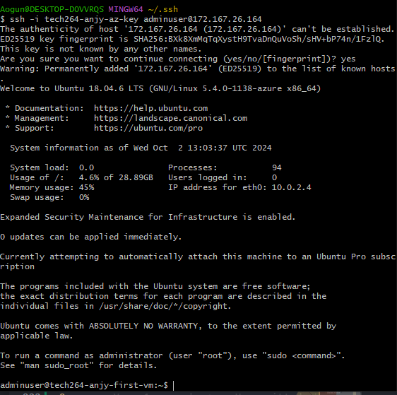
11. TO EXIT TYPE "EXIT" IN GIT BASH

## With a path (will find the key from any folder in your home direc)
1. in the at the 3rd prompt "Copy and execute SSH command"
2. enter a "~/.ssh" before the key

3. copy and paste into Git Bash window
4. then it should look like the end product of the previous list

