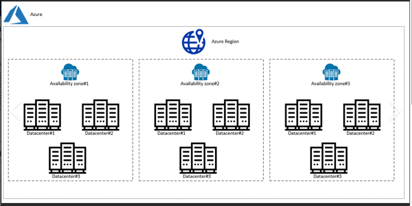

# Research Azure basics

### The basics of Azure
Azure is a microsoft cloud computing platform. Azure offers IaaS (virtual machine), PaaS (building, testing and deploying apps) and SaaS (microsoft 365).

The services that Azure offers:
- compute: Virtual machines, containers (e.g., Azure Kubernetes Service), and serverless computing (Azure Functions).
- Storage: Scalable cloud storage for data, files, and databases, including Azure Blob Storage and Azure SQL Database.
- Networking: Virtual networks, load balancers, VPN gateways for managing network infrastructure.
- Databases: Managed databases, including SQL Database, Cosmos DB (NoSQL), and Azure Database for MySQL/PostgreSQL.
- AI & Machine Learning: Pre-built APIs and tools like Azure Cognitive Services and Azure Machine Learning.
- DevOps: Tools like Azure DevOps and GitHub integration to automate software development pipelines.

### Azure regions and availability zones: how they work and include up-to-date diagrams to help

An Azure region is an area on the globe that Microsoft has at least one data center.

These regions are to allow Microsoft to let their users deploy resources close to their location so there is 100% compliance to local regulations

Availability zones are WITHIN a region, they are separate locations and each have a data center. These zones are designed to ensure high availability and protect resources from localized failures, like power outages or natural disasters.

When deploying Azure resources, you can choose a region, and within that region, you can deploy resources across Availability Zones. This ensures your app remains available even if one zone experiences an outage.

### How is Azure structured/organized?

Azure organized hierarchically:
1. Management Groups (company-wide governance)
    - Subscriptions (billing and limits)
        - Resource Groups (logical grouping of resources)
            - Resources (e.g., virtual machines, databases)
2. Regions (geographical locations with Availability Zones for fault tolerance)
3. Azure AD (identity management with role-based access)
4. Tags, Policies, and Blueprints (for organization and compliance)

### What types of services does Azure provide?

1. **Compute**: 
   - Virtual Machines, Kubernetes (AKS), App Service, Azure Functions, Batch.

2. **Storage**: 
   - Blob Storage, File Storage, Disk Storage, Queue Storage, Data Lake Storage.

3. **Networking**: 
   - Virtual Network (VNet), Load Balancer, Application Gateway, VPN Gateway, CDN, DNS.

4. **Databases**: 
   - SQL Database, Cosmos DB, MySQL/PostgreSQL, SQL Managed Instance, Cache for Redis.

5. **AI & Machine Learning**: 
   - Cognitive Services, Machine Learning, Bot Services, OpenAI Service.

6. **Analytics & Big Data**: 
   - Synapse Analytics, Data Lake Analytics, HDInsight, Stream Analytics, Databricks.

7. **DevOps**: 
   - Azure DevOps, Pipelines, Repos, Test Plans, Artifacts.

8. **Security & Identity**: 
   - Azure AD, Key Vault, Security Center, Sentinel, DDoS Protection.

9. **IoT**: 
   - IoT Hub, IoT Central, Digital Twins, Azure Sphere.

10. **Mixed Reality**: 
   - Spatial Anchors, Remote Rendering.

11. **Hybrid & Multi-cloud**: 
   - Azure Arc, Azure Stack, VMware Solution.

12. **Monitoring & Management**: 
   - Azure Monitor, Automation, Cost Management, Policy.

13. **Blockchain**: 
   - Azure Blockchain Service, Workbench.

14. **Migration Tools**: 
   - Azure Migrate, Site Recovery.

15. **Media Services**: 
   - Media Services, Video Analyzer.

### Ways to access Azure?
- Azure portal
- Azure command line
- Azure powershell
- Azure mobile apps
- Azure RESTful APIs
- Azure resource manager
- Software Development Kits (SDKs) and libraries

### Explain the difference between Azure and Azure DevOps

Azure is a cloud computing platform with a wide range of cloud services for building, deploying, and managing applications and infrastructure.

Azure DevOps is a development tools and services focused on collaboration, continuous integration (CI), continuous delivery (CD), and DevOps practices.

### Why use the Azure Pricing Calculator?

1. **Cost Estimation**: Provides pricing for services based on usage.
2. **Budget Planning**: Helps control cloud spending.
3. **Service Comparison**: Compare costs of different services and regions.
4. **Customization**: Tailor configurations for accurate cost projections.
5. **Cost Optimization**: Identify savings through different options.
6. **Transparency**: Offers clear pricing with no hidden fees.
7. **Scenario Planning**: Model different usage scenarios to predict costs.

### Main takeaways  

In the README.md, add + personalise the content with your own comments, "take-aways", things you've learnt. Supplement the content with extra research where you feel your understanding is weaker.

Understand the content so you are ready to be asked interview questions on the topic

- 

