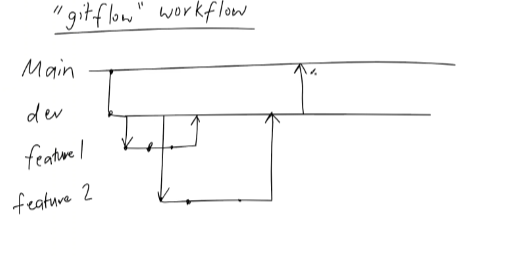
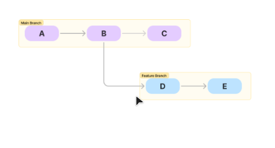
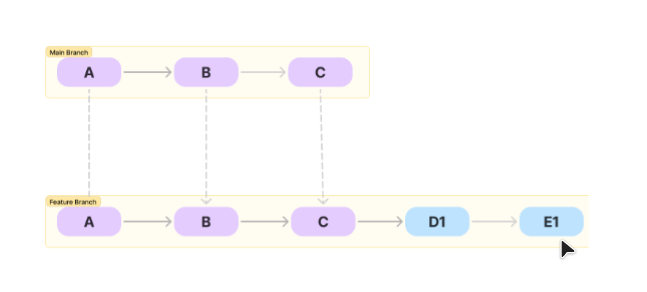

## Git merge to merge branches
A branch is a separate development 
``` git branch *name*``` create a branch
``` git branch -M *name*``` renames the master branch

``` git checkout -b *name*``` 
or
``` git switch -c *name*``` 
to create branch and switched immediately 

```git checkout *name*``` 
or 
```git switch *name*```
to switch branches

```git merge *new branch*``` make sure the new branch has commit and only put this command in the branch you want TO MERGE INTO. not the branch you've made changes in 

gitflow workflow (common, there are multiple types of git work flows):
  - main branch, dev branch and feature branches. 
  - the feature branch is always merged into dev branch and tested before being finally merged with the main branch
  - dev code will be deployed but only for testing users or quality assurance users or maybe a subset of end users (10%)



## git reset

```git reset --hard HARD~1``` hard reset- remove the commit and the changes made in that commit

```git reset --soft HARD~1``` soft reset - remove the commit but keep the changes in the staging area

```git reset --mixed HARD~1```  mixed reset - remove the commit but remove the changes from the staging area

feedback:
- would be better if there was a situation/problem to explain clearer - use a context
- how to i fix this? STAR approach
- bc of time - only do what the task asks (only do soft and hard sections)
- too many gif & too much text & talking - can't be too distracting
- the diagrams need more clarity
- explain technical stuff - eg. HEAD~1 is the previous commit 
- zoom in to right part of the terminal
  


## git merge and merge conflicts

when do conflicts happen:
- same line edit
- editing adjacent lines 
- deletion on one branch but modified in another
- overlapping changes to project structure

How to resolve

- manually 
  1. find the conflict 
  2. go to the file/s that the conflict is
  3. decide which lines to keep, remove and modify
    - change either of the branches
    - override one of the branches
    - change and adjust files yourself
  4. save the changes 
  5. add changes to staging 
  6. commit

  
- github/IDE/CLI
- 

How to avoid
- git uses a pull request to get approval first
- can automate a CI/CD pipeline to speed up the process
- frequently pulling and merging to the main branch

## git rebase
```git rebase *main branch* *file you wanna update*``` input command on the main 
``` git rebase --abort``` will revert to stage pre rebase
``` git rebase --continue``` after you've fixed a conflict 
- lots of ppl working on different commits at different times

- allows you to integrate changes from one branch to another and prevent conflict

- moves/combines the sequence of commits to a new base commit- rewriting history of that branch
pre rebase:

post rebase (the feature branch has the updated history):


- used to maintain a linear project history
- ensure the future branch is up to date
