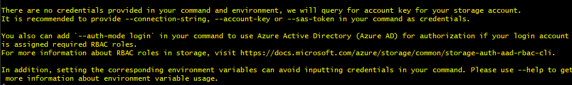
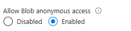

- [what is Linux](#what-is-linux)
- [Linux commands](#linux-commands)
- [Navigating files and folders](#navigating-files-and-folders)
- [Installing a package \[FIRST THING TO DO WHEN U OPEN YOUR VM\]](#installing-a-package-first-thing-to-do-when-u-open-your-vm)
- [Running multiple commands as the Super User](#running-multiple-commands-as-the-super-user)

### what is Linux
- Linux is a clone of UNIX os, used to be used on large mainframes 
- We're using linux for it flexibility, cheaper price, stable os, scales up very easily.
- Often used for DevOps
- ubuntu is just one distribution (like one flavour/version of linux)
- BASH is a shell interprets the linux commands 
- 
### Linux commands
- ```ls```lists the files and direc
- ``` cd``` followed by the name of the direc to open a direc
- ```ls -a``` lists hidden files too
- ``` pwd ``` prints the presenr working direc
- ``` mkdir``` followed by the name you choose creates a direc, can make multiple if there is a space btwn each file name
  -  if you want a space in the file name, use quotes
- ``` rmdir``` removes an empty direc
- ```rm``` followed by the name of the file removes them
- ```rm -r``` followed by name of direc
- ```cp *source* *destination*``` copies files or direc
- ```mv *old_name* *new_name*``` moves ore renames a file or direc
- ```Touch ``` followed by the name you choose creates a empty file
- ```cat``` followed by the name of the chosen file shows the contents of said file
- ```find -name "*file name*"```  searches for files and direc
- ``` tree``` displays a tree-like structure of direc or files
- ```uname -a``` find out info about the os
- ```whoami``` tells you who the user is
- ```cat /etc/shells``` tells you what shells are available
- ``` ps -p $$``` tells you the processes being used (bash) and terminal session you are on
- ``` history``` give you a history of every command used when logged into the VM [Clear the history if you used a command w sensitive info]
  - ```!"number"``` number if from the history list
- ``` --help``` shows a list of commands
- ```history -w``` amd ```history -c``` to clear the history or the history file
- ```ls -l``` long format view of everything in the file
- ```ls -al``` show long format of hidden files in direc, if it begins w "d" it is folder (also if it's blue)
- ```cd .``` current folder
- ```cd ..``` parent folder
 
### Navigating files and folders
- ```curl *a website link* --output *name of file include the file extension*``` download and save file from a website of choice as the name you choose
- ```wget *a website link* -O *name of file, include the file extension*``` download and save file from a website of choice as the name you choose
- ``` file *file name, include file ext*``` tells you the type of file it is
- ```nano *file name*``` text editor
- ctrl s - saves
- ctrl x - exit
- ``` head ``` top of the file and ``` tails``` bottom of the file; specific lines from a file eg. log files
  - ``` head -2 *file name*``` give the top two lines
- ```nl *filename* ```numbers the lines in the file
- piping (|), output from one file and input into another
  - ``` cat *file name* | grep *text you want to to search for*``` output the files and uses grep to search for text 
  
- ``` cd /``` cd into the top of the direc tree, root direc [BE CAREFUL CAN BREAK]


### Installing a package [FIRST THING TO DO WHEN U OPEN YOUR VM]
root in linux is the super user- all permissions 
```apt``` is a package manager
```sudo``` is Super User DO

- ```sudo apt update -y``` to update the package list from a source list, the ```-y``` means yes to any prompted questions
- ``` sudo apt install *package*``` eg. tree package which does this: 
- ``` sudo apt upgrade -y```upgrade all the packages installed CAN BREAK OS (sys software may need/already running a specific version of a specific package)

### Running multiple commands as the Super User
- ``` cd /``` cd into the top of the direc tree, root direc [BE CAREFUL CAN BREAK]
- there is a *root* folder for the SU
- ``` sudo su``` log in as rootuser to access the *root* folder
- *exit* to log out
  