- [Navigating Files and Folders](#navigating-files-and-folders)
  - [Installing a package \[FIRST THING TO DO WHEN U OPEN YOUR VM\]](#installing-a-package-first-thing-to-do-when-u-open-your-vm)
  - [Running Multiple Commands as the Super User](#running-multiple-commands-as-the-super-user)
- [Making a shell (BASH) Script](#making-a-shell-bash-script)
- [Environment Variables](#environment-variables)
    - [Set a Variable (for a script)](#set-a-variable-for-a-script)
    - [Set an Environment Variable](#set-an-environment-variable)
    - [Set a Persistent Variable](#set-a-persistent-variable)
- [Managing Processes](#managing-processes)
  - [User Processes](#user-processes)
  - [System Processes](#system-processes)
    - [Running a Process](#running-a-process)
    - [Killing a Process](#killing-a-process)

### what is Linux?
- Linux is a clone of UNIX os, used to be used on large mainframes 
- We're using linux for it flexibility, cheaper price, stable os, scales up very easily.
- Often used for DevOps
- ubuntu is just one distribution (like one flavour/version of linux)
- BASH is a shell interprets the linux commands 
- 
### Linux Commands
- ```ls```lists the files and direc
- ``` cd``` followed by the name of the direc to open a direc
- ```ls -a``` lists hidden files too
- ``` pwd ``` prints the presenr working direc
- ``` mkdir``` followed by the name you choose creates a direc, can make multiple if there is a space btwn each file name
  -  if you want a space in the file name, use quotes
- ``` rmdir``` removes an empty direc
- ```rm``` followed by the name of the file removes them
- ```rm -r``` followed by name of direc  (r means recursive so it deletes contents)
- ```cp *source* *destination*``` copies files or direc
- ```mv *old_name* *new_name/new folder within direc*``` moves or renames a file or direc
- ``` mv *file_name" ..``` moves file to parent direc
- ``` mv *file_name* ~``` moves file to home direc
- ```Touch ``` followed by the name you choose creates a empty file
- ```cat``` followed by the name of the chosen file shows the contents of said file
- ```find -name "*file name*"```  searches for files and direc
- ``` tree``` displays a tree-like structure of direc or files
- ```uname -a``` find out info about the os
- ```whoami``` tells you who the user is
- ```cat /etc/shells``` tells you what shells are available
- ``` ps -p $$``` tells you the processes being used (bash) and terminal session you are on
- ``` history``` give you a history of every command used when logged into the VM [Clear the history if you used a command w sensitive info]
  - ```!"number"``` number if from the history list
- ``` --help``` shows a list of commands
- ```history -w``` amd ```history -c``` to clear the history or the history file
- ```ls -l``` long format view of everything in the file
- ```ls -al``` show long format of hidden files in direc, if it begins w "d" it is folder (also if it's blue)
- ```cd .``` current folder
- ```cd ..``` parent folder
- ```nano *file name*``` text editor
  - ctrl s - saves
  - ctrl x - exit

 
## Navigating Files and Folders
- ```curl *a website link* --output *name of file include the file extension*``` download and save file from a website of choice as the name you choose
- ```wget *a website link* -O *name of file, include the file extension*``` download and save file from a website of choice as the name you choose
- ``` file *file name, include file ext*``` tells you the type of file it is
- ``` head ``` top of the file and ``` tails``` bottom of the file; specific lines from a file eg. log files
  - ``` head -2 *file name*``` give the top two lines
- ```nl *filename* ```numbers the lines in the file
- piping (|), output from one file and input into another
  - ``` cat *file name* | grep *text you want to to search for*``` output the files and uses grep to search for text 
  
- ``` cd /``` cd into the top of the direc tree, root direc [BE CAREFUL CAN BREAK]


### Installing a package [FIRST THING TO DO WHEN U OPEN YOUR VM]
root in linux is the super user- all permissions 
```apt``` is a package manager
```sudo``` is Super User DO

- ```sudo apt update -y``` to update the package list from a source list, the ```-y``` means yes to any prompted questions
- ``` sudo apt install *package*```
  -  eg. tree package (allows you to see files ina different way to ls) which does this: 
- ``` sudo apt upgrade -y```upgrade all the packages installed CAN BREAK OS (sys software may need/already running a specific version of a specific package)

### Running Multiple Commands as the Super User
- ``` cd /``` cd into the top of the direc tree, root direc [BE CAREFUL CAN BREAK]
- there is a *root* folder for the SU
- ``` sudo su``` log in as rootuser to access the *root* folder
- *exit* to log out

## Making a shell (BASH) Script
- make a files names "provision" 
  - can use nano ``` nano provision.sh``` 
  - ``` .sh ``` means shell
- must specify the shell to specify which shell to use to run the scripts 
  - ``` #!*path to bash shell* ```
  - 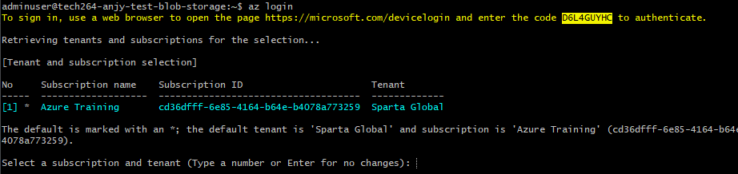
- plan the script file
  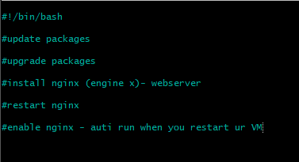
- we know these commands work as we have tested them manually so we can put them straight into the script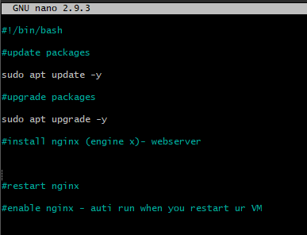 
- Now test the command to install nginx
  - ctrl s & ctrl x to save and exit the script
  - back in the terminal test the command
   ```sudo apt install nginx -y``` (the script will not work if user input is required, ```-y``` means no pop ups will occur)
  - now to make sure nginx webserver is running
    1. ``` sudo systemctl status nginx```can be used to check system process
    2. you can also open Azure:
      - copy the public ip address on your vm overview page
      - search the IP address
    - if theres a problem and the 1. command works but the website doesnt show, you may need to change the rules on NSG (network security group)
      - go to networks and click NSG to add or remove rules
        - add/remove traffic: settings -> inbound security rule
- ctrl z to get out
- ```sudo systemctl restart nginx``` restart nginx
- ```sudo systemctl enable nginx``` enable ngix - enabling means it will automatically run when VM is logged into again
- completed:
  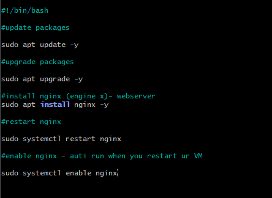
- ```chmod +x provision.sh``` you need to add permissions to execute
- ```./provision.sh ```run the script,
  - "." means the script is in the current direc.

## Environment Variables
A value is stored in memory with a particular name so we can refer to it, it is available to any tool/command that wants to look up and get said values.

They can be used to put credentials into memory- ONLY TEMPORARILY MUST BE DELETED AFTER.

They can be set by your sys(windows/linux) but you can do it to

This environment variable we are setting uo contains info about where to go to find a database
 - ```printenv``` prints out environment variables onto the screen
- ```printenv *env variable name* ``` print out just one env variable, match the caplocks 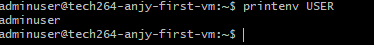
  
#### Set a Variable (for a script)
- use caplocks to write the variable name then "=" 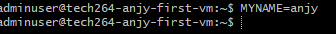
- to see a normal variable use ``` echo $*variablename*``` 
  
#### Set an Environment Variable
- ```export *set the name and value*``` set like with a normal variable 
  
#### Set a Persistent Variable
- To allow a env var to stay when you log out and log in - persistence
  - set env var in the ```.bashrc``` file in your home direc. that loads up every time you log in
  - so it will be set that the variable will still exist if you log in as that user
  -  ```nano .bashrc``` nano into the .bashrc file and add the env. var. in that file 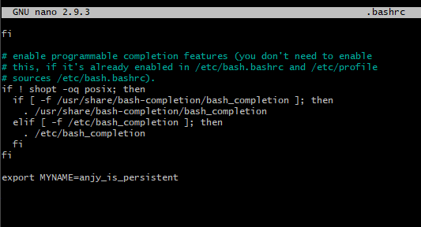
  -  log out and log back in and it will be there is you print env. var.
- Make your env. var. persistent WITHOUT nano'ing into the ```.bashrc``` file
  - ```echo "export *variablename=variablevlaue" >> .bashrc```use echo and put into quotes, it takes the output from the echo command and puts it the file
  - ```>``` will replace EVERYTHING in the .bashrc file 
  - ```>>``` will APPEND the output to the bottom of the ```.bashrc``` file 
- eg. 

## Managing Processes
A process is a program that been loaded into memory (RAM) (not doing much)
When running (executing a program) one core is needed, if multiple processes are running at the same time - moore cores are required

### User Processes
Processes that a user had run on a terminal - associated with a terminal session
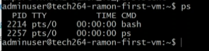
^ this shows the user processes running, use the command ```ps```

TTY is the terminal session ID ```pts/0``` means first terminal logged in

### System Processes
- To see ALL the processes use ``` ps -A``` 
- ```ps -aux```shows ALL the information about ALL the processes
- almost every process is started by another
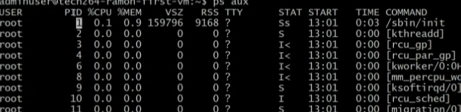
^ Highlighted is the process ID
- shift + m shows the process using up the memory
- shift + n shows the newest processes
- shift + p shows the most processing power

#### Running a Process
- ```sleep *num"```sleep command causes a delay in seconds incase the previous command hasn't been fully configed yet- running in the foreground
- ``` sleep *num* &``` running in the background
  - will give you a process id
   
- ```jobs``` shows you processes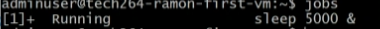

#### Killing a Process
- ctrl + z can stop a process in the foreground
- ``` kill -1 *process id*``` hang up signal to gently stop a process
- ``` kill *process id*``` terminate slightly harsher kill signal (level 15)
- ```kill -9 *process id*``` brute force kill signal (level 9)
  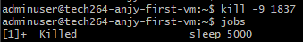
- Be vary using brute force bc:
  - A tool (process manager - also a process) can be used to manage other process
  - a process can run and use on a specific port
  - if you want to run another process using that port you have to kill it
  - but if you brute force kill, the process manager will start another process bc thats it's job
  - if you kill the parent process it can leave the child processes in memory running as a zombie process - probably still occupying the port
  - if you use level 15 (standard termination) on the parent process manager  it will GRACEFULLY kill the child processes and then the parent