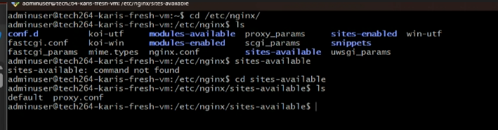

- [What is Linux?](#what-is-linux)
- [Linux Commands](#linux-commands)
- [Navigating Files and Folders](#navigating-files-and-folders)
  - [Installing a package \[FIRST THING TO DO WHEN U OPEN YOUR VM\]](#installing-a-package-first-thing-to-do-when-u-open-your-vm)
  - [Running Multiple Commands as the Super User](#running-multiple-commands-as-the-super-user)
- [Making a shell (BASH) Script](#making-a-shell-bash-script)
- [Environment Variables](#environment-variables)
    - [Set a Variable (for a script)](#set-a-variable-for-a-script)
    - [Set an Environment Variable](#set-an-environment-variable)
    - [Set a Persistent Variable](#set-a-persistent-variable)
- [Managing Processes](#managing-processes)
  - [User Processes](#user-processes)
  - [System Processes](#system-processes)
    - [Running a Process](#running-a-process)
    - [Killing a Process](#killing-a-process)
- [New VM to run the app](#new-vm-to-run-the-app)
  - [Test your code before creating a script](#test-your-code-before-creating-a-script)
  - [Install dependency (for our app)](#install-dependency-for-our-app)
  - [move the scp (secure copy) to copy app folder into the home direc of the VM (app)](#move-the-scp-secure-copy-to-copy-app-folder-into-the-home-direc-of-the-vm-app)
  - [move git/git clone to copy app folder into the home  direc of the VM (app)](#move-gitgit-clone-to-copy-app-folder-into-the-home--direc-of-the-vm-app)
  - [How to get the app running manually](#how-to-get-the-app-running-manually)
- [Create another VM for app database](#create-another-vm-for-app-database)
- [Now to connect app VM to db VM](#now-to-connect-app-vm-to-db-vm)
- [TASK: Stage 1, Create a provisions script to run app in the background](#task-stage-1-create-a-provisions-script-to-run-app-in-the-background)
- [TASK: stage 2, Create a provisions script for mongo DB](#task-stage-2-create-a-provisions-script-for-mongo-db)
    - [port 3000 is in use, kill the old process](#port-3000-is-in-use-kill-the-old-process)
    - [sparta runs in the back ground- use a process manager pm2 to stop the process rather than killing it](#sparta-runs-in-the-back-ground--use-a-process-manager-pm2-to-stop-the-process-rather-than-killing-it)
    - [get the reverse proxy working - would be in app script (after the install nginx file)](#get-the-reverse-proxy-working---would-be-in-app-script-after-the-install-nginx-file)

## What is Linux?
- Linux is a clone of UNIX os, used to be used on large mainframes 
- We're using linux for it flexibility, cheaper price, stable os, scales up very easily.
  - Often used for DevOps
  - open source - easy top customize and tailor (optimization)
  - flexibility- can run on lots of different os
  - integrate - offers powerful command line driven tools (terraform and ansible)
  - very stable and secure - consistently works reliably 
  - 


- ubuntu is just one distribution (like one flavour/version of linux)
- BASH is a shell interprets the linux commands 
- 
## Linux Commands
- ```ls```lists the files and direc
- ``` cd``` followed by the name of the direc to open a direc
- ```ls -a``` lists hidden files too
- ``` pwd ``` prints the present working direc
- ``` mkdir``` followed by the name you choose creates a direc, can make multiple if there is a space btwn each file name
  -  if you want a space in the file name, use quotes
- ``` rmdir``` removes an empty direc
- ```rm``` followed by the name of the file removes them
- ```rm -r``` followed by name of direc  (r means recursive so it deletes contents)
- ```cp *source* *destination*``` copies files or direc
- ```mv *old_name* *new_name/new folder within direc*``` moves or renames a file or direc
- ``` mv *file_name" ..``` moves file to parent direc
- ``` mv *file_name* ~``` moves file to home direc
- ```Touch ``` followed by the name you choose creates a empty file
- ```cat``` followed by the name of the chosen file shows the contents of said file
- ```find -name "*file name*"```  searches for files and direc
- ``` tree``` displays a tree-like structure of direc or files
- ```uname -a``` find out info about the os
- ```whoami``` tells you who the user is
- ```cat /etc/shells``` tells you what shells are available
- ``` ps -p $$``` tells you the processes being used (bash) and terminal session you are on
- ``` history``` give you a history of every command used when logged into the VM [Clear the history if you used a command w sensitive info]
  - ```!"number"``` number if from the history list
- ``` --help``` shows a list of commands
- ```history -w``` amd ```history -c``` to clear the history or the history file
- ```ls -l``` long format view of everything in the file
- ```ls -al``` show long format of hidden files in direc, if it begins w "d" it is folder (also if it's blue)
- ```cd .``` current folder
- ```cd ..``` parent folder
- ```nano *file name*``` text editor
  - ctrl s - saves
  - ctrl x - exit

 
## Navigating Files and Folders
- ```curl *a website link* --output *name of file include the file extension*``` download and save file from a website of choice as the name you choose
- ```wget *a website link* -O *name of file, include the file extension*``` download and save file from a website of choice as the name you choose
- ``` file *file name, include file ext*``` tells you the type of file it is
- ``` head ``` top of the file and ``` tails``` bottom of the file; specific lines from a file eg. log files
  - ``` head -2 *file name*``` give the top two lines
- ```nl *filename* ```numbers the lines in the file
- piping (|), output from one file and input into another
  - ``` cat *file name* | grep *text you want to to search for*``` output the files and uses grep to search for text 
  
- ``` cd /``` cd into the top of the direc tree, root direc [BE CAREFUL CAN BREAK]


### Installing a package [FIRST THING TO DO WHEN U OPEN YOUR VM]
root in linux is the super user- all permissions 
```apt``` is a package manager or you can use ```apt-get```
```sudo``` is Super User DO

- ```sudo apt(-get) update -y``` to update the package list from a source list, the ```-y``` means yes to any prompted questions
- ``` sudo apt install *package*```
  -  eg. tree package (allows you to see files ina different way to ls) which does this: 
- ``` sudo apt upgrade -y```upgrade all the packages installed CAN BREAK OS (sys software may need/already running a specific version of a specific package)

### Running Multiple Commands as the Super User
- ``` cd /``` cd into the top of the direc tree, root direc [BE CAREFUL CAN BREAK]
- there is a *root* folder for the SU
- ``` sudo su``` log in as rootuser to access the *root* folder
- *exit* to log out

## Making a shell (BASH) Script
- make a files names "provision" 
  - can use nano ``` nano provision.sh``` 
  - ``` .sh ``` means shell
- must specify the shell to specify which shell to use to run the scripts 
  - ``` #!*path to bash shell* ```
  - 
- plan the script file
  
- we know these commands work as we have tested them manually so we can put them straight into the script 
- Now test the command to install nginx
  - ctrl s & ctrl x to save and exit the script
  - back in the terminal test the command
   ```sudo apt install nginx -y``` (the script will not work if user input is required, ```-y``` means no pop ups will occur)
  - now to make sure nginx webserver is running
    1. ``` sudo systemctl status nginx```can be used to check system process
    2. you can also open Azure:
      - copy the public ip address on your vm overview page
      - search the IP address
    - if theres a problem and the 1. command works but the website doesnt show, you may need to change the rules on NSG (network security group)
      - go to networks and click NSG to add or remove rules
        - add/remove traffic: settings -> inbound security rule
- ctrl z to get out
- ```sudo systemctl restart nginx``` restart nginx
- ```sudo systemctl enable nginx``` enable ngix - enabling means it will automatically run when VM is logged into again
- completed:
  
- ```chmod +x provision.sh``` you need to add permissions to execute
- ```./provision.sh ```run the script,
  - "." means the script is in the current direc.

## Environment Variables
A value is stored in memory with a particular name so we can refer to it, it is available to any tool/command that wants to look up and get said values.

The purpose is to stored a value in the os so a particular tool, software or code that will need to refer to is at a later time.
 -eg. how to connect to a database; an env ver store the connection string.
- They can be used to put credentials into memory- ONLY TEMPORARILY MUST BE DELETED AFTER. so you don't hard code sensitive data into your project.
  

They can be set by your sys(windows/linux) but you can do it to

This environment variable we are setting up contains info about where to go to find a database.

 - ```printenv``` prints out environment variables onto the screen
- ```printenv *env variable name* ``` print out just one env variable, match the caplocks 
  
#### Set a Variable (for a script)
- use caplocks to write the variable name then "=" 
- to see a normal variable use ``` echo $*variablename*``` 
  
#### Set an Environment Variable
- ```export *set the name and value*``` set like with a normal variable 
  
#### Set a Persistent Variable
- To allow a env var to stay when you log out and log in - persistence
  - set env var in the ```.bashrc``` file in your home direc. that loads up every time you log in
  - so it will be set that the variable will still exist if you log in as that user
  -  ```nano .bashrc``` nano into the .bashrc file and add the env. var. in that file 
  -  log out and log back in and it will be there is you print env. var.
- Make your env. var. persistent WITHOUT nano'ing into the ```.bashrc``` file
  - ```echo "export *variablename=variablevlaue" >> .bashrc```use echo and put into quotes, it takes the output from the echo command and puts it the file
  - ```>``` will replace EVERYTHING in the .bashrc file 
  - ```>>``` will APPEND the output to the bottom of the ```.bashrc``` file 
- eg. 

## Managing Processes
A process is a program that been loaded into memory (RAM) (not doing much)
When running (executing a program) one core is needed, if multiple processes are running at the same time - moore cores are required

### User Processes
Processes that a user had run on a terminal - associated with a terminal session

^ this shows the user processes running, use the command ```ps```

TTY is the terminal session ID ```pts/0``` means first terminal logged in

### System Processes
- To see ALL the processes use ``` ps -A``` 
- ```ps -aux```shows ALL the information about ALL the processes
- almost every process is started by another

^ Highlighted is the process ID
- shift + m shows the process using up the memory
- shift + n shows the newest processes
- shift + p shows the most processing power

#### Running a Process
- ```sleep *num"```sleep command causes a delay in seconds incase the previous command hasn't been fully configed yet- running in the foreground
- ``` sleep *num* &``` running in the background
  - will give you a process id
   
- ```jobs``` shows you processes

#### Killing a Process
- ctrl + z can stop a process in the foreground
- ``` kill -1 *process id*``` hang up signal to gently stop a process
- ``` kill *process id*``` terminate slightly harsher kill signal (level 15)
- ```kill -9 *process id*``` brute force kill signal (level 9)
  
- Be vary using brute force bc:
  - A tool (process manager - also a process) can be used to manage other process
  - a process can run and use on a specific port
  - if you want to run another process using that port you have to kill it
  - but if you brute force kill, the process manager will start another process bc thats it's job
  - if you kill the parent process it can leave the child processes in memory running as a zombie process - probably still occupying the port
  - if you use level 15 (standard termination) on the parent process manager  it will GRACEFULLY kill the child processes and then the parent
  

## New VM to run the app
- create VM to run the app

### Test your code before creating a script
- do your sudo apt update and upgrade- do this to check that command wont ask for user input bc of a different image on a different VM
- if it asks for user input "tab + enter"
- to make sure upgrade doesn't ask for user input on a FRESH vm use ```sudo DEBIAN_FRONTEND=noninteractive apt-get upgrade -y``` 
- install nginx and add the DEBIAN to make sure it's not interactive (no user inputs) 
  ```sudo DEBIAN_FRONTEND=noninteractive apt-get install nginx -y```
  
### Install dependency (for our app)
- curl to download content from the internet
-  download script file to download node js with NO POP UPS (bc of the addition of the ```DEBIAN_FRONTEND=noninteractive```)
````
curl -fsSL https://deb.nodesource.com/setup_20.x | sudo -E bash - &&\
sudo DEBIAN_FRONTEND=noninteractive apt-get install -y nodejs
````

- ```node -v``` check if the node js is installed
- now the commands have been tested, now put them into a script
  - ``` nano prov-app.sh``` to make and ano into a script
  - echo to tell us how far the script is going. 
```
#!/bin/bash
 
echo update sources list...
sudo apt-get update -y
echo Done!
 
echo upgrade any packages available...
sudo DEBIAN_FRONTEND=noninteractive apt-get upgrade -y
echo Done!
 
echo install nginx...
sudo DEBIAN_FRONTEND=noninteractive apt-get install nginx -y
echo Done!
 
echo install nodejs v20...
curl -fsSL https://deb.nodesource.com/setup_20.x | sudo -E bash - &&\
sudo DEBIAN_FRONTEND=noninteractive apt-get install -y nodejs
echo Done!
 
echo check nodejs version...
node -v
echo Done!
```
- change permissions to allow execution ```chmod +x prov-app.sh```
- execute the script ```./prov-app.sh```
  

### move the scp (secure copy) to copy app folder into the home direc of the VM (app)
- unzip the file with the app data in it
- copy the unzipped app code an place in a file "app" in your vm
  - ```scp -i <path_to_private_key> <local_file_path> <username>@<remote_host>:<remote_directory_path>``` use the scp command to move the app code 

### move git/git clone to copy app folder into the home  direc of the VM (app)
- ssh into your app vm
- use the command sudo apt to upgrade and then install git, if you don't already have it ```sudo apt-get update
sudo apt-get install git```
- cd into the repo you'd like to clone into
- clone via https 
``` git clone https://github.com/<username>/<repository_name>.git```

```https://github.com/N-AO5/tech264-sparta-app.git```

- ls to double check the clone is now on your VM


### How to get the app running manually
- log back into your VM
- cd into the file that contains the app code
- cd into the app folder then ```npm install```
- if there are warning- make sure they're not red, at least for testing
- make sure there are 0 vulnerabilities
- when installed now we run (this is just the front page)
- ```node app.js``` to run the app
  
- when you go to a IP address is will default port 480
- add access in NIC rules 
  - go to your VM and go to network setting to change the inbound destination to port 3000
  - the lower the priority number, the higher the priority
   
- add :*port number* to go to the required port number in the url 
- ctrl + z to stop the app running 

## Create another VM for app database 
- follow -the instructions on the Azure code along
- do your update and upgrade commands (with the DEBIAN_FRONTEND=noninteractive for upgrade)
- install gnupg to ensure future commands work ```sudo apt-get install gnupg curl```
- install mongodb server (the version that is compatible with the app)
  
```
curl -fsSL https://www.mongodb.org/static/pgp/server-7.0.asc | \
   sudo gpg -o /usr/share/keyrings/mongodb-server-7.0.gpg \
   --dearmor
   ```

- install source file list - the sources of the packages needed to install mongodb 
  ```
  echo "deb [ arch=amd64,arm64 signed-by=/usr/share/keyrings/mongodb-server-7.0.gpg ] https://repo.mongodb.org/apt/ubuntu jammy/mongodb-org/7.0 multiverse" | sudo tee /etc/apt/sources.list.d/mongodb-org-7.0.list
  ```
  - now update to make sure we have the updated version of these packages
  - now download mongodb
  
```
  sudo DEBIAN_FRONTEND=noninteractive apt-get install -y mongodb-org=7.0.6 mongodb-org-database=7.0.6 mongodb-org-server=7.0.6 mongodb-mongosh=2.1.5 mongodb-org-mongos=7.0.6 mongodb-org-tools=7.0.6
```

  - to run the mongodb ```sudo systemctl start mongod```
  - currently not accepting any IPs other than a connection from the local machine (only this vm- Local IP 127.0.0.1) so use ```sudo nano /etc/mongod.conf``` to open the config file for mongo and change the network **Bind IP** to 0.0.0.0 - this will allow traffic/connections from any ID addresses to access the database
- restart the mongo db ```sudo systemctl restart mongod```
- check if enabled? ```sudo systemctl is-enabled mongod```
- enable it ```sudo systemctl enable mongod```

(use a command scd to change the bind ip when automation in the script)

## Now to connect app VM to db VM
- open another gitbash window and login to the run app VM
- cd into app folder
- we need to create a pipe to allow the vm to run the db vm by making an env. ver.
- ```DB_HOST=mongodb://10.0.3.4:27017/posts``` to export using the private IP as you're already "inside""
- Check? ```printenv DB_HOST```
- install ```npm install```
- db should be seeded, if the ip/post page is empty use ```node seeds/seed.js``` then npm start 

## TASK: Stage 1, Create a provisions script to run app in the background

use the & in your script 
write app script
delete old vm and create new vm and test the script 
create the provisions script - ```nano prov-app.s```

```
#!/bin/bash

echo update sources list...
sudo apt update -y
echo Done.

echo upgrade any upgradable packages available...
sudo DEBIAN_FRONTEND=noninteractive apt-get upgrade -y
echo Done.

echo install nginx...
sudo DEBIAN_FRONTEND=noninteractive apt-get install nginx -y
echo Done.

echo install nodejs v20...
curl -fsSL https://deb.nodesource.com/setup_20.x | sudo -E bash - &&\
sudo DEBIAN_FRONTEND=noninteractive apt-get install -y nodejs
echo Done!

echo check nodejs version...
node -v
echo Done!

echo Cloning GitHub repository...
git clone https://github.com/N-AO5/tech264-sparta-app.git 
echo Done!

echo cd into the app file
cd tech264-sparta-app/app
echo now into the app file

echo npm install
npm install
echo npm install done

echo run the app in the background
node app.js & 
echo all done!
````
REMEMBER!
- change permissions to allow execution ```chmod +x prov-app.sh```
- execute the script ```./prov-app.sh```

ALSO!
- when you used a git clone, it names the cloned repo the same name as on github- to change the local repo name add the new name after the url 
ALSO!
- you can use npm start or node app.js (for our purposes)
  
- to test 
  - create new VM
  - ssh in
  - ``` nano prov-app.sh``` to create your script
  - copy script into shell file
  - change permissions to give permission ```chmod +x prov-app.sh```
  - execute ```./prov-app.sh```
  - change NSG rules to allow to port 3000
  - check at *IP address*:3000

## TASK: stage 2, Create a provisions script for mongo DB 

- create the provisions script ```nano prov-db.sh```

```
#!/bin/bash
 
# Update the system package list
echo Updating package list...
sudo apt-get update -y
echo Done!
 
# Upgrade all installed packages to their latest versions
echo Upgrading installed packages...
sudo DEBIAN_FRONTEND=noninteractive apt-get upgrade -y
echo Done!
 
echo Installing gnupg and curl...
sudo apt-get install gnupg curl -y
echo Done!
 
# Download and add MongoDB GPG key for package verification
echo Adding MongoDB GPG key...
sudo rm -f /usr/share/keyrings/mongodb-server-7.0.gpg # Remove key if one exists
curl -fsSL https://www.mongodb.org/static/pgp/server-7.0.asc | sudo gpg --yes -o /usr/share/keyrings/mongodb-server-7.0.gpg --dearmor
echo Done!
 
# Add MongoDB repository to the sources list
echo Adding MongoDB repository to sources list...
echo "deb [ arch=amd64,arm64 signed-by=/usr/share/keyrings/mongodb-server-7.0.gpg ] https://repo.mongodb.org/apt/ubuntu jammy/mongodb-org/7.0 multiverse" | sudo tee /etc/apt/sources.list.d/mongodb-org-7.0.list
echo Done!
 
# Update package list again to include the newly added MongoDB repository
echo Updating package list with MongoDB repository...
sudo DEBIAN_FRONTEND=noninteractive apt-get update -y
echo Done!
 
# Install MongoDB version 7.0.6 and specific associated packages non-interactively
echo Installing MongoDB and related packages...
sudo DEBIAN_FRONTEND=noninteractive apt-get install -y \
    mongodb-org=7.0.6 \
    mongodb-org-database=7.0.6 \
    mongodb-org-server=7.0.6 \
    mongodb-org-shell=7.0.6 \
    mongodb-org-mongos=7.0.6
echo Done!
 
# Start MongoDB service immediately
echo Starting MongoDB service...
sudo systemctl start mongod
echo Done!
 
# Enable MongoDB service to start on boot
echo Enabling MongoDB service to start on boot...
sudo systemctl enable mongod
echo Done!
 
# Modify MongoDB configuration to allow remote connections
echo Configuring MongoDB to allow remote connections...
sudo sed -i 's/127.0.0.1/0.0.0.0/g' /etc/mongod.conf
echo Done!
 
# Restart MongoDB service to apply configurations
echo Restarting MongoDB service...
sudo systemctl start mongod
echo Done!

````
- change permissions to allow you to execute ```chmod +x prov-db.sh```
- run script ```./prov-db.sh```


line 26 eof while looking for macthing "
ling 65 systax error


#### port 3000 is in use, kill the old process

#### sparta runs in the back ground- use a process manager pm2 to stop the process rather than killing it

#### get the reverse proxy working - would be in app script (after the install nginx file)

- to get to our app you have to add the port number for the app
- to fix this - we need something to redirect traffic to port 3000 when we go to the public IP



- ```sudo cp /etc/nginx/nginx.conf /etc/nginx/nginx.conf.backup``` to copy and therefore back up the nginx config file
-```/etc/nginx/sites-available``` into the nginx file 

- ```sudo nano proxy.conf``` create another default file and add
```
  server {
    listen 80;
    server_name your_domain_or_ip;

    location / {
        proxy_pass http://localhost:3000;
        proxy_set_header Host $host;
        proxy_set_header X-Real-IP $remote_addr;
        proxy_set_header X-Forwarded-For $proxy_add_x_forwarded_for;
        proxy_set_header X-Forwarded-Proto $scheme;
    }
}
```
- ```sudo ln -s /etc/nginx/sites-available/proxy.conf /etc/nginx/sites-enabled/``` links the file we made to the enabled sites in teh etc file- therefore enabling nginx

- ```sudo systemctl restart nginx```


