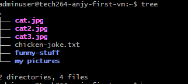
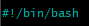
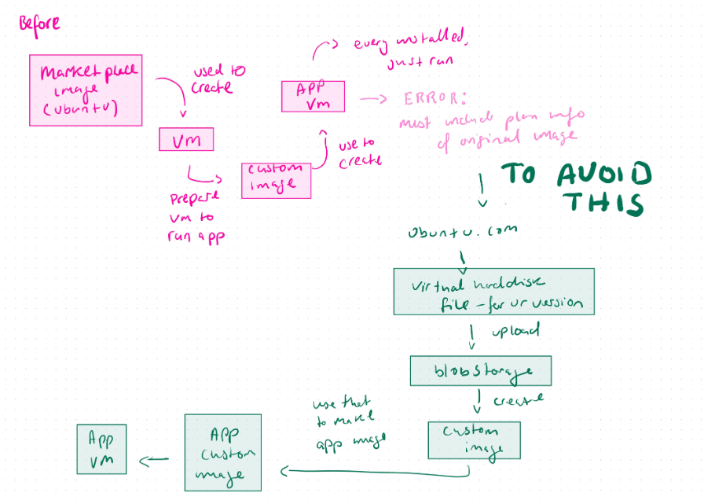
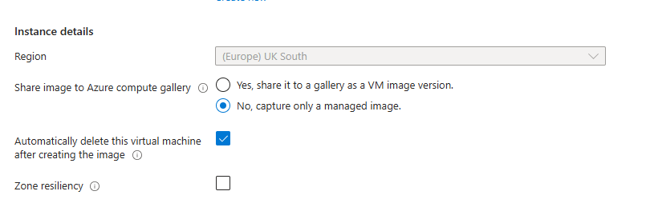
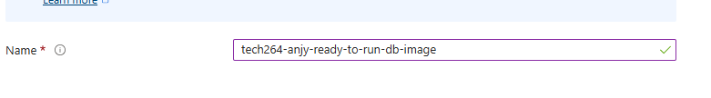
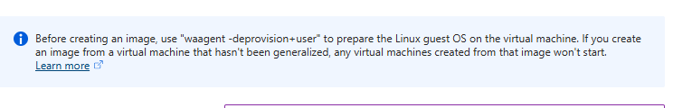
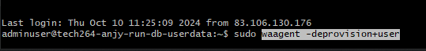
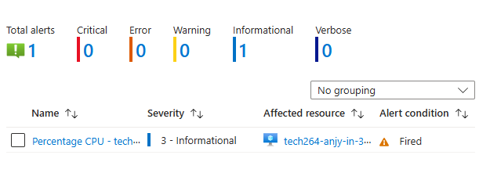
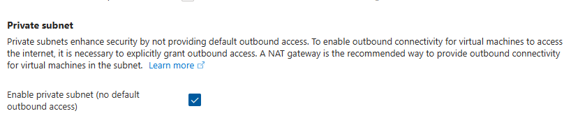

- [What is Linux?](#what-is-linux)
- [Linux Commands](#linux-commands)
- [Navigating Files and Folders](#navigating-files-and-folders)
  - [Installing a package \[FIRST THING TO DO WHEN U OPEN YOUR VM\]](#installing-a-package-first-thing-to-do-when-u-open-your-vm)
  - [Running Multiple Commands as the Super User](#running-multiple-commands-as-the-super-user)
- [Making a shell (BASH) Script](#making-a-shell-bash-script)
- [Environment Variables](#environment-variables)
    - [Set a Variable (for a script)](#set-a-variable-for-a-script)
    - [Set an Environment Variable](#set-an-environment-variable)
    - [Set a Persistent Variable](#set-a-persistent-variable)
      - [Option 1](#option-1)
      - [Option 2- avoid having to ssh in and out to reload the .bashrc file](#option-2--avoid-having-to-ssh-in-and-out-to-reload-the-bashrc-file)
- [Managing Processes](#managing-processes)
  - [User Processes](#user-processes)
  - [System Processes](#system-processes)
    - [Running a Process](#running-a-process)
    - [Killing a Process](#killing-a-process)
- [New VM to run the app](#new-vm-to-run-the-app)
  - [Test your code before creating a script](#test-your-code-before-creating-a-script)
  - [Install dependency (for our app)](#install-dependency-for-our-app)
  - [move the scp (secure copy) to copy app folder into the home direc of the VM (app)](#move-the-scp-secure-copy-to-copy-app-folder-into-the-home-direc-of-the-vm-app)
  - [move git/git clone to copy app folder into the home  direc of the VM (app)](#move-gitgit-clone-to-copy-app-folder-into-the-home--direc-of-the-vm-app)
  - [How to get the app running manually](#how-to-get-the-app-running-manually)
- [Create another VM for app database](#create-another-vm-for-app-database)
- [Now to connect app VM to db VM](#now-to-connect-app-vm-to-db-vm)
- [Task: Stage 1, Create a provisions script to run app in the background](#task-stage-1-create-a-provisions-script-to-run-app-in-the-background)
- [Task: stage 2, Create a provisions script for mongo DB](#task-stage-2-create-a-provisions-script-for-mongo-db)
- [Task:How many services can use a port](#taskhow-many-services-can-use-a-port)
- [Task: Reverse proxy - would be in app script (after the install nginx file)](#task-reverse-proxy---would-be-in-app-script-after-the-install-nginx-file)
- [VM security](#vm-security)
- [Task: Run Sparta app in the background - using pm2](#task-run-sparta-app-in-the-background---using-pm2)
    - [What is pm2](#what-is-pm2)
    - [How to used pm2](#how-to-used-pm2)
- [Task: Automate configuration of nginx reverse proxy](#task-automate-configuration-of-nginx-reverse-proxy)
- [Task: User data](#task-user-data)
- [Levels of automation- Deploying out app on the cloud](#levels-of-automation--deploying-out-app-on-the-cloud)
  - [Create an new VM using Ramon's image](#create-an-new-vm-using-ramons-image)
  - [Create an image for our virtual machines](#create-an-image-for-our-virtual-machines)
- [Monitoring and Alert management](#monitoring-and-alert-management)
    - [How can you increase the management of a vm crash](#how-can-you-increase-the-management-of-a-vm-crash)
    - [Types of scaling](#types-of-scaling)
- [Test Monitoring](#test-monitoring)
    - [Create a dashboard](#create-a-dashboard)
    - [Now for some load testing](#now-for-some-load-testing)
- [Azure VM Scale Set (aka Auto scaling on AWS)](#azure-vm-scale-set-aka-auto-scaling-on-aws)
    - [AZ VM scale set architecture](#az-vm-scale-set-architecture)
    - [How to make a scale set](#how-to-make-a-scale-set)
    - [Documentation about load balancers](#documentation-about-load-balancers)
- [Task: Azure Monitoring \& Alert Management](#task-azure-monitoring--alert-management)
    - [What is worst to best in terms of monitoring and responding to load/traffic.](#what-is-worst-to-best-in-terms-of-monitoring-and-responding-to-loadtraffic)
    - [How you setup a dashboard](#how-you-setup-a-dashboard)
    - [How a combination of load testing and the dashboard helped us](#how-a-combination-of-load-testing-and-the-dashboard-helped-us)
    - [Create a CPU usage alert for your app instance → you should get a notification sent your email](#create-a-cpu-usage-alert-for-your-app-instance--you-should-get-a-notification-sent-your-email)
    - [Removing Dashboard, Alerts, and Action groups](#removing-dashboard-alerts-and-action-groups)
- [Task: Research VM availability options on Azure](#task-research-vm-availability-options-on-azure)
    - [What is an availability set? How do they work? Advantages/disadvantages?](#what-is-an-availability-set-how-do-they-work-advantagesdisadvantages)
    - [What is an availability zone? Why superior to an availability set? Disadvantages?](#what-is-an-availability-zone-why-superior-to-an-availability-set-disadvantages)
  - [What is a Virtual Machine Scale Set? What type of scaling does it do? How does it work? Limitations?](#what-is-a-virtual-machine-scale-set-what-type-of-scaling-does-it-do-how-does-it-work-limitations)
- [Securing the DB with a DMZ subnet](#securing-the-db-with-a-dmz-subnet)
  - [Steps for Code-along](#steps-for-code-along)

## What is Linux?
- Linux is a clone of UNIX os, used to be used on large mainframes 
- We're using linux for it flexibility, cheaper price, stable os, scales up very easily.
  - Often used for DevOps
  - open source - easy top customize and tailor (optimization)
  - flexibility- can run on lots of different os
  - integrate - offers powerful command line driven tools (terraform and ansible)
  - very stable and secure - consistently works reliably 
  - 


- ubuntu is just one distribution (like one flavour/version of linux)
- BASH is a shell interprets the linux commands 
- 
## Linux Commands
- ```ls```lists the files and direc
- ``` cd``` followed by the name of the direc to open a direc
- ```ls -a``` lists hidden files too
- ``` pwd ``` prints the present working direc
- ``` mkdir``` followed by the name you choose creates a direc, can make multiple if there is a space btwn each file name
  -  if you want a space in the file name, use quotes
- ``` rmdir``` removes an empty direc
- ```rm``` followed by the name of the file removes them
- ```rm -r``` followed by name of direc  (r means recursive so it deletes contents)
- ```cp *source* *destination*``` copies files or direc
- ```mv *old_name* *new_name/new folder within direc*``` moves or renames a file or direc
- ``` mv *file_name" ..``` moves file to parent direc
- ``` mv *file_name* ~``` moves file to home direc
- ```Touch ``` followed by the name you choose creates a empty file
- ```cat``` followed by the name of the chosen file shows the contents of said file
- ```find -name "*file name*"```  searches for files and direc
- ``` tree``` displays a tree-like structure of direc or files
- ```uname -a``` find out info about the os
- ```whoami``` tells you who the user is
- ```cat /etc/shells``` tells you what shells are available
- ``` ps -p $$``` tells you the processes being used (bash) and terminal session you are on
- ``` history``` give you a history of every command used when logged into the VM [Clear the history if you used a command w sensitive info]
  - ```!"number"``` number if from the history list
- ``` --help``` shows a list of commands
- ```history -w``` amd ```history -c``` to clear the history or the history file
- ```ls -l``` long format view of everything in the file
- ```ls -al``` show long format of hidden files in direc, if it begins w "d" it is folder (also if it's blue)
- ```cd .``` current folder
- ```cd ..``` parent folder
- ```nano *file name*``` text editor
  - ctrl s - saves
  - ctrl x - exit

 
## Navigating Files and Folders
- ```curl *a website link* --output *name of file include the file extension*``` download and save file from a website of choice as the name you choose
- ```wget *a website link* -O *name of file, include the file extension*``` download and save file from a website of choice as the name you choose
- ``` file *file name, include file ext*``` tells you the type of file it is
- ``` head ``` top of the file and ``` tails``` bottom of the file; specific lines from a file eg. log files
  - ``` head -2 *file name*``` give the top two lines
- ```nl *filename* ```numbers the lines in the file
- piping (|), output from one file and input into another
  - ``` cat *file name* | grep *text you want to to search for*``` output the files and uses grep to search for text 
  
- ``` cd /``` cd into the top of the direc tree, root direc [BE CAREFUL CAN BREAK]


### Installing a package [FIRST THING TO DO WHEN U OPEN YOUR VM]
root in linux is the super user- all permissions 
```apt``` is a package manager or you can use ```apt-get```
```sudo``` is Super User DO

- ```sudo apt(-get) update -y``` to update the package list from a source list, the ```-y``` means yes to any prompted questions
- ``` sudo apt install *package*```
  -  eg. tree package (allows you to see files ina different way to ls) which does this:
- ``` sudo apt upgrade -y```upgrade all the packages installed CAN BREAK OS (sys software may need/already running a specific version of a specific package)

### Running Multiple Commands as the Super User
- ``` cd /``` cd into the top of the direc tree, root direc [BE CAREFUL CAN BREAK]
- there is a *root* folder for the SU
- ``` sudo su``` log in as rootuser to access the *root* folder
- *exit* to log out

## Making a shell (BASH) Script
- make a files names "provision" 
  - can use nano ``` nano provision.sh``` 
  - ``` .sh ``` means shell
- must specify the shell to specify which shell to use to run the scripts 
  - ``` #!*path to bash shell* ```
  - 
- plan the script file
  
- we know these commands work as we have tested them manually so we can put them straight into the script
- Now test the command to install nginx
  - ctrl s & ctrl x to save and exit the script
  - back in the terminal test the command
   ```sudo apt install nginx -y``` (the script will not work if user input is required, ```-y``` means no pop ups will occur)
  - now to make sure nginx webserver is running
    1. ``` sudo systemctl status nginx```can be used to check system process
    2. you can also open Azure:
      - copy the public ip address on your vm overview page
      - search the IP address
    - if theres a problem and the 1. command works but the website doesnt show, you may need to change the rules on NSG (network security group)
      - go to networks and click NSG to add or remove rules
        - add/remove traffic: settings -> inbound security rule
- ctrl z to get out
- ```sudo systemctl restart nginx``` restart nginx
- ```sudo systemctl enable nginx``` enable ngix - enabling means it will automatically run when VM is logged into again
- completed:
 
- ```chmod +x provision.sh``` you need to add permissions to execute
- ```./provision.sh ```run the script,
  - "." means the script is in the current direc.

## Environment Variables
A value is stored in memory with a particular name so we can refer to it, it is available to any tool/command that wants to look up and get said values.

The purpose is to stored a value in the os so a particular tool, software or code that will need to refer to is at a later time.
 -eg. how to connect to a database; an env ver store the connection string.
- They can be used to put credentials into memory- ONLY TEMPORARILY MUST BE DELETED AFTER. so you don't hard code sensitive data into your project.
  

They can be set by your sys(windows/linux) but you can do it to

This environment variable we are setting up contains info about where to go to find a database.

 - ```printenv``` prints out environment variables onto the screen
- ```printenv *env variable name* ``` print out just one env variable, match the caplocks 
  
#### Set a Variable (for a script)
- use caplocks to write the variable name then "=" 
- to see a normal variable use ``` echo $*variablename*```
  
#### Set an Environment Variable
- ```export *set the name and value*``` set like with a normal variable 
  
#### Set a Persistent Variable

##### Option 1
- To allow a env var to stay when you log out and log in - persistence
  - set env var in the ```.bashrc``` file in your home direc. that loads up every time you log in
  - so it will be set that the variable will still exist if you log in as that user
  -  ```nano .bashrc``` nano into the .bashrc file and add the env. var. in that file 
  -  log out and log back in and it will be there is you print env. var.
- Make your env. var. persistent WITHOUT nano'ing into the ```.bashrc``` file
  - ```echo "export *variablename=variablevlaue" >> .bashrc```use echo and put into quotes, it takes the output from the echo command and puts it the file
  - ```>``` will replace EVERYTHING in the .bashrc file 
  - ```>>``` will APPEND the output to the bottom of the ```.bashrc``` file 
- eg. 

##### Option 2- avoid having to ssh in and out to reload the .bashrc file
- ```source.bashrc``` to assign the env. var. and reload the config and therefore reload the export command


## Managing Processes
A process is a program that been loaded into memory (RAM) (not doing much)
When running (executing a program) one core is needed, if multiple processes are running at the same time - moore cores are required

### User Processes
Processes that a user had run on a terminal - associated with a terminal session

^ this shows the user processes running, use the command ```ps```

TTY is the terminal session ID ```pts/0``` means first terminal logged in

### System Processes
- To see ALL the processes use ``` ps -A``` 
- ```ps -aux```shows ALL the information about ALL the processes
- almost every process is started by another

^ Highlighted is the process ID
- shift + m shows the process using up the memory
- shift + n shows the newest processes
- shift + p shows the most processing power

#### Running a Process
- ```sleep *num"```sleep command causes a delay in seconds incase the previous command hasn't been fully configed yet- running in the foreground
- ``` sleep *num* &``` running in the background
  - will give you a process id
   
- ```jobs``` shows you processes

#### Killing a Process
- ctrl + z can stop a process in the foreground
- ``` kill -1 *process id*``` hang up signal to gently stop a process
- ``` kill *process id*``` terminate slightly harsher kill signal (level 15)
- ```kill -9 *process id*``` brute force kill signal (level 9)
  
- Be vary using brute force bc:
  - A tool (process manager - also a process) can be used to manage other process
  - a process can run and use on a specific port
  - if you want to run another process using that port you have to kill it
  - but if you brute force kill, the process manager will start another process bc thats it's job
  - if you kill the parent process it can leave the child processes in memory running as a zombie process - probably still occupying the port
  - if you use level 15 (standard termination) on the parent process manager  it will GRACEFULLY kill the child processes and then the parent
  

## New VM to run the app
- create VM to run the app

### Test your code before creating a script
- do your sudo apt update and upgrade- do this to check that command wont ask for user input bc of a different image on a different VM
- if it asks for user input "tab + enter"
- to make sure upgrade doesn't ask for user input on a FRESH vm use ```sudo DEBIAN_FRONTEND=noninteractive apt-get upgrade -y``` 
- install nginx and add the DEBIAN to make sure it's not interactive (no user inputs) 
  ```sudo DEBIAN_FRONTEND=noninteractive apt-get install nginx -y```
  
### Install dependency (for our app)
- curl to download content from the internet
-  download script file to download node js with NO POP UPS (bc of the addition of the ```DEBIAN_FRONTEND=noninteractive```)
````
curl -fsSL https://deb.nodesource.com/setup_20.x | sudo -E bash - &&\
sudo DEBIAN_FRONTEND=noninteractive apt-get install -y nodejs
````

- ```node -v``` check if the node js is installed
- now the commands have been tested, now put them into a script
  - ``` nano prov-app.sh``` to make and ano into a script
  - echo to tell us how far the script is going. 
```
#!/bin/bash
 
echo update sources list...
sudo apt-get update -y
echo Done!
 
echo upgrade any packages available...
sudo DEBIAN_FRONTEND=noninteractive apt-get upgrade -y
echo Done!
 
echo install nginx...
sudo DEBIAN_FRONTEND=noninteractive apt-get install nginx -y
echo Done!
 
echo install nodejs v20...
curl -fsSL https://deb.nodesource.com/setup_20.x | sudo -E bash - &&\
sudo DEBIAN_FRONTEND=noninteractive apt-get install -y nodejs
echo Done!
 
echo check nodejs version...
node -v
echo Done!
```
- change permissions to allow execution ```chmod +x prov-app.sh```
- execute the script ```./prov-app.sh```
  

### move the scp (secure copy) to copy app folder into the home direc of the VM (app)
- unzip the file with the app data in it
- copy the unzipped app code an place in a file "app" in your vm
  - ```scp -i <path_to_private_key> <local_file_path> <username>@<remote_host>:<remote_directory_path>``` use the scp command to move the app code 

### move git/git clone to copy app folder into the home  direc of the VM (app)
- ssh into your app vm
- use the command sudo apt to upgrade and then install git, if you don't already have it ```sudo apt-get update
sudo apt-get install git```
- cd into the repo you'd like to clone into
- clone via https 
``` git clone https://github.com/<username>/<repository_name>.git```

```https://github.com/N-AO5/tech264-sparta-app.git```

- ls to double check the clone is now on your VM


### How to get the app running manually
- log back into your VM
- cd into the file that contains the app code
- cd into the app folder then ```npm install```
- if there are warning- make sure they're not red, at least for testing
- make sure there are 0 vulnerabilities
- when installed now we run (this is just the front page)
- ```node app.js``` to run the app
  
- when you go to a IP address is will default port 480
- add access in NIC rules 
  - go to your VM and go to network setting to change the inbound destination to port 3000
  - the lower the priority number, the higher the priority
   
- add :*port number* to go to the required port number in the url 
- ctrl + z to stop the app running 

## Create another VM for app database 
- follow -the instructions on the Azure code along
- do your update and upgrade commands (with the DEBIAN_FRONTEND=noninteractive for upgrade)
- install gnupg to ensure future commands work ```sudo apt-get install gnupg curl```
- install mongodb server (the version that is compatible with the app)
  
```
curl -fsSL https://www.mongodb.org/static/pgp/server-7.0.asc | \
   sudo gpg -o /usr/share/keyrings/mongodb-server-7.0.gpg \
   --dearmor
   ```

- install source file list - the sources of the packages needed to install mongodb 
  ```
  echo "deb [ arch=amd64,arm64 signed-by=/usr/share/keyrings/mongodb-server-7.0.gpg ] https://repo.mongodb.org/apt/ubuntu jammy/mongodb-org/7.0 multiverse" | sudo tee /etc/apt/sources.list.d/mongodb-org-7.0.list
  ```
  - now update to make sure we have the updated version of these packages
  - now download mongodb
  
```
  sudo DEBIAN_FRONTEND=noninteractive apt-get install -y mongodb-org=7.0.6 mongodb-org-database=7.0.6 mongodb-org-server=7.0.6 mongodb-mongosh=2.1.5 mongodb-org-mongos=7.0.6 mongodb-org-tools=7.0.6
```

  - to run the mongodb ```sudo systemctl start mongod```
  - currently not accepting any IPs other than a connection from the local machine (only this vm- Local IP 127.0.0.1) so use ```sudo nano /etc/mongod.conf``` to open the config file for mongo and change the network **Bind IP** to 0.0.0.0 - this will allow traffic/connections from any ID addresses to access the database
- restart the mongo db ```sudo systemctl restart mongod```
- check if enabled? ```sudo systemctl is-enabled mongod```
- enable it ```sudo systemctl enable mongod```

(use a command scd to change the bind ip when automation in the script)

## Now to connect app VM to db VM
- open another gitbash window and login to the run app VM
- cd into app folder
- we need to create a pipe to allow the vm to run the db vm by making an env. ver.
- ```DB_HOST=mongodb://10.0.3.4:27017/posts``` to export using the private IP as you're already "inside""
- Check? ```printenv DB_HOST```
- install ```npm install```
- db should be seeded, if the ip/post page is empty use ```node seeds/seed.js``` then npm start 

## Task: Stage 1, Create a provisions script to run app in the background

use the & in your script 
write app script
delete old vm and create new vm and test the script 
create the provisions script - ```nano prov-app.sh```

[prov-app.sh](prov-app.sh)


REMEMBER!
- change permissions to allow execution ```chmod +x prov-app.sh```
- execute the script ```./prov-app.sh```

ALSO!
- when you used a git clone, it names the cloned repo the same name as on github- to change the local repo name add the new name after the url 
ALSO!
- you can use npm start or node app.js (for our purposes)
  
- to test 
  - create new VM
  - ssh in
  - ``` nano prov-app.sh``` to create your script
  - copy script into shell file
  - change permissions to give permission ```chmod +x prov-app.sh```
  - execute ```./prov-app.sh```
  - change NSG rules to allow to port 3000
  - check at *IP address*:3000

## Task: stage 2, Create a provisions script for mongo DB 

- create the provisions script ```nano prov-db.sh```

 [prov-db.sh script](prov-db.sh)

- change permissions to allow you to execute ```chmod +x prov-db.sh```
- run script ```./prov-db.sh```

to connect the DB and app, add to the beginning of app script 

```
MONGODB__HOST="mongodb://10.0.3.4:27017"
 
echo "Connect via our VMs via IP."
export DB_HOST=$MONGODB__HOST
echo "Connection complete."
echo "Set env variable"
printenv DB_HOST
echo "env variable set."
```

## Task:How many services can use a port

Port 3000 is in use, kill the old process


sparta runs in the back ground- use a process manager pm2 to stop the process rather than killing it

## Task: Reverse proxy - would be in app script (after the install nginx file)

- to get to our app you have to add the port number for the app
- to fix this - we need something to redirect traffic to port 3000 when we go to the public IP


- ```sudo cp /etc/nginx/nginx.conf /etc/nginx/nginx.conf.backup``` to copy and therefore back up the nginx config file
-```/etc/nginx/sites-available``` into the nginx file 

- ```sudo nano proxy.conf``` create another default file and add

```
  server {
    listen 80;
    server_name *your ip*;

    location / {
        proxy_pass http://localhost:3000;
        
    }
}
```
OR 
modify 
```
location / {
       try_files $url $url/ =404;
}
```
and replace with
```
location / {
        proxy_pass http://localhost:3000;
}

```

- ``` sudo nginx -t``` to see if theres an error in the syntax of the file

- ```sudo ln -s /etc/nginx/sites-available/proxy.conf /etc/nginx/sites-enabled/``` links the file we made to the enabled sites in the etc file- therefore enabling nginx

- ```sudo systemctl restart nginx```


## VM security
NSG - Network ... 
- Go to network settings on app vm
- go to inbound security rules
- on allows private key that user has, BUT an IP can try to ssh into out machine
- click rule and change source to *my IP address*
- now only me and my IP address can try to ssh in- therefore better security
  -but our public IP changes every time the router is restarted so you'll have to save my IP again
- if this is a production server and you don't want ANYONE to ssh in- remove the rule or change action to deny

## Task: Run Sparta app in the background - using pm2

#### What is pm2
A production process manager that allows you to run your apps in the background, keep them alive (restart automatically if they crash), monitor performance, and handle logs.

#### How to used pm2
using ```&``` to run in background isn't good bc you'll have to find and kill the process to allow it to run again.

1. ``` sudo npm install -g pm2 ```install PM2 in your script after you've updated, upgraded, installed mongo and installed node js
2. instead of ```npm start &``` or ```node app.js &``` put ```pm2 start npm app.js``` at the end of your script.
3. you can use the command ```pm2 stop npm``` If you have multiple processes managed by PM2 that were started with the npm -- start, you can stop them all using this command. This effectively halts the application, but does not remove it from PM2's process list
4.  and ```pm2 restart npm``` to This command restarts the running process associated with the npm command. PM2 will first stop the current instance and then start it again, ensuring any updates or changes are applied
5.  use ```pm2 stop all``` to stop all previous process so the script is usable multiple times
6.  to stop the app when running using user data and using pm2, you need to kill pm2 (the process manager) gracefully and then kill the child process


Work out ways to both run, stop and re-start the app in the background (besides using the "&" at the end of the command):

One way should use pm2
If time: One other way (can you find another package manager do it like pm2?)
You should have already used "&" at the end the command to run the app in the background - document the issue with using this method when it comes to stopping/re-starting the app
Document the methods you got working
Check the app is working in your browser at the IP address of the VM with :3000 appended to the end (or without port 3000 in the URL if your reverse proxy is running).

## Task: Automate configuration of nginx reverse proxy
This allows us to use the public IP without specifying which port the app is running, this is done by ngninx by changing the bind IP to 0.0.0.0.


the -i means replace 

use the sed command to replace the Bind IP 
```
sed -i '0,/location \/ {/s//location \/ {\n        proxy_pass http:\/\/localhost:3000;/' /etc/nginx/sites-available/default
```

```
sudo sed -i 's|try_files $uri $uri/ =404;|proxy_pass http://localhost:3000;|' /etc/nginx/sites-available/default
```

you can test using ```sudo nginx -t```

## Task: User data
- tick the box in tab before "tags" when creating a VM - only HTTP
- Used to achieve next level automation
- anything pasted (app script) into the user data box will run- 
- ONLY runs ONCE as ROOT USER when the vm is created- to tun the app again just use the last few commands to run the app again
  - doesn't start in home directory
  - runs from the root folder (the very top of the direct) 
  - remember to adjust your git clone- the cloned repo will be in the root folder (no need for a file path, just cd into sparta folder) 
  - ```sudo cat /var/log/cloud-init-output.log``` to see inside the log file that contains your user data script when in your vm
  - to restart the app after you've logged out and logged back in ```pm2 start app.js```
- When you start you new vm you should see:
  1. Error in the first 6 seconds
  2. nginx home page
  3. 502 error: bad gateway - while the app begins to run
  4. app displays
- when restarting the app - connected to the db 
  1. cd into root direc ```cd /repo/app```
  2. Set mongodb env. var.```export DB_HOST="mongodb://*DB IP*:27017/posts"```
  3. use sudo to act as super user but the ```-E``` allows the program to access the env. var. in non super user space ```sudo -E pm2 start app.js``` 


## Levels of automation- Deploying out app on the cloud

level 1. manually test the commands - ssh in

level 2. run a bash script with the commands - ssh 

level 3, input script into user data - no need to ssh in

level 4: use an image + some user data (prov-app-starting-code.sh) to make things run faster
  - (makes app come up faster when you run your vm)
  - an image is a stored screenshot (os, files, folders) of your entire machine on the disc
  - can be used to start new vm with the same set of files
  - remember you still need to run the app to get it started (the extra lil user data)



### Create an new VM using Ramon's image
- create both app vm and db vm
- use bash scripts and input into user data
- ensure in the app vm script has the correct private ip (of the db vm) for db_host env. var.
- test both vms (see scripts)
- ensure the app page shows up on url
  
### Create an image for our virtual machines
1. go to resource for your vm
2. capture -> image
3. select these:
  
  if you tick that box then the vm delete after you create the image - your vm will be unusable post image creation
4. rename to a suitable name 
  
5. run this command when you ssh into your vm
  
  
  ```sudo waagent -deprovision+user```
  it allows you to delete all the user data ready to be image 
6. then you can click create

## Monitoring and Alert management  
#### How can you increase the management of a vm crash


#### Types of scaling


## Test Monitoring
we create an app vm using the images previously created

#### Create a dashboard
(to turn on the app again after you must manually ssh in and start it)
1. go to monitoring tab
   - cpu average
   - disk bytes
   - can see more metrics if you click link at the bottom
2. click the pin on the CPU average 
3. make a new, shared dashboard and fill in

4. add network total and disk operations metrics onto the dashboard 
5. search dashboards at the top 
6. click your dashboard
7. can rearrange dashboards
   1. click edit (lil pencil)
   2. rearrange by dragging and dropping
   3. remember to save
8. to see the last 30 mins for example
   1. click the metric you want change the time frame for 


#### Now for some load testing
To find out what an appropriate threshold is required for an alarm system

1. ssh into your machine, run the app and get your dashboard open where you can view
  - ```cd /``` to cd into the root repo
  - cd into your repo, app and use ```sudo pm2 start app.js```
  - you can also just use ```sudo pm2 start /repo/app/app.js``` from your home repo
2. check that the app is working if you check you public IP address 
3. use a tool to increase the CPU (central processing unit)- 
   1. it is a very small app with simple code and therefore doesn't need much cpu
   2. the tool throws lots of requests to the app- just for testing
4. install apache ```sudo apt-get install apache2-utils -y```
5. ``` ab -n 1000 -c 100 http://20.26.235.114/``` command sends 1000 req. in blocks of 100, and add your IP where it says http 
6. spike from the first 1000 req.

1. tells you on your github details about how long each request takes 
2. next inc. values ```ab -n 10000 -c 200 http://20.162.241.78/``` 10 thousand req. in blocks of 200.
3. it processes much slower then times out
4.  

## Azure VM Scale Set (aka Auto scaling on AWS)
The aim of this scale set to achieve high availability (multiple availability zones and multiple vms as a minimum- determined by load/performance testing) and high 
scalability (multiple vms or vm scales up). 

#### AZ VM scale set architecture  


#### How to make a scale set
1. search vm scale set
2. create
3. fill in like so:
   
1. select autoscaling
2. adjust scaling config 
3. add your image (you made)
4. fill rest as usual
5. do disc - standard ssd
6. do networking 
   1.  choose your subnet and edit the network interface
   2.  inbound ports ssh and http as well as public subnet (creating the apps scale set)
   3.  disable public ip cos each vm does NOT need a public IP address
   4.  select/create a load balancer
       1.  tick az load balancer
       2.  name using standard name convention
       3.  keep it public
       4.  can change backend port (load balancer rule) to the port we used ie 3000 (if we didn't have the nginx config.)
       5.  inbound NAT rule- theres an increment of 1 in the inbound port per vm to ssh into the vm (port number re. to know which port your vm is in)
       6.  create
7. go to health
8. enable app health monitoring
9. enable auto repairs - replace and wait 10 mins before going in to repair

10. in the advanced tab,tick user data and add your RUN APP ONLY script
[run-app-only](run-app-only.sh)
1.  tag yourself
2.  create
3.  re restarting - start and then click reimage to userdata to restart again- copying the image over again
4.  can upgrade image to all vms
5.  check instances to see your vms and their health - only marks it if the instance is running
6.  to test - use load balancers ip address to view app 
7.  to ssh in =to one of your vms
    1.  go to instances 
    2.  go to connect -> via ssh
    3.  put in key 
    4.  change to the public ip address of the load balance and add the inbound port (-p 50000)
     ```ssh -i tech264-anjy-az-key -p 50000 adminuser@85.210.201.160```
 8.  To delete, select:
     1.  vm scale set
     2.  public ip 
     3.  load balancers
     4.  NSG for all the NIC
   

#### Documentation about load balancers

- what is a load balancer and why it is needed
how to manage instances

A load balancer is a service that distributes incoming network traffic across multiple instances to ensure that no single server is overwhelmed. It distributes the load evenly, improving the performance, availability, and reliability of applications.

- steps on how to create an unhealthy instance (for testing) and why it is marked as healthy/unhealthy
  1. go to scale set
  2. search operating system 
  3. modify user data to remove the npm start
  4. delete one of your instances
  5. the next one the load balancer creates will be unhealthy
  6. it is marked as unhealthy because in the user data that runs initial script doesn't have a command to run the app

  1. you can just stop and restart the instance, it will become unhealthy
  2. it is marked that way bc user data won't run again until you reimage
 
  1. ssh in and cd into root folder and stop/kill the app
  2. there will be no app running and it the instance will be unhealthy


- steps on how to SSH into an instance
  
 1.  go to instances 
 2.  go to connect -> via ssh
 3.  put in key 
 4.  change to the public ip address of the load balance and add the inbound port (-p 50000)
 ```ssh -i tech264-anjy-az-key -p 50000 adminuser@85.210.201.160```

- steps on how to delete a VM Scale Set and all it's connecting parts
  
To delete, select:
     1.  vm scale set
     2.  public ip 
     3.  load balancers
     4.  NSG for all the NIC

---
## Task: Azure Monitoring & Alert Management

Document what was done in the code-along, including...

#### What is worst to best in terms of monitoring and responding to load/traffic.
The worst is manual monitoring. Manually checking the vm metrics and making adjustments when there is a chance of crashing.

Next, using a monitor to keep an eye on the metrics but this must also be manually monitored and responded to.

Next, the use of an alarm improves automation further as you'll receive an alert when the metrics are abnormally (eg the CPU is too high) which will allow you to manually adjust.

The best is to use a monitor, alert management and a load balancer. The load balancer will scale up or down your system in response to the metrics of all your vms and therefore handle load before a crash


<hr>
#### How you setup a dashboard
(to turn on the app again after you must manually ssh in and start it)
1. go to monitoring tab
   - cpu average
   - disk bytes
   - can see more metrics if you click link at the bottom
2. click the pin on the CPU average 
3. make a new, shared dashboard and fill in
   


1. add network total and disk operations metrics onto the dashboard 
2. search dashboards at the top 
3. click your dashboard
4. can rearrange dashboards
   1. click edit (lil pencil)
   2. rearrange by dragging and dropping
   3. remember to save
5. to see the last 30 mins for example
   1. click the metric you want change the time frame for 
   
   
   
#### How a combination of load testing and the dashboard helped us
The load testing allows us to increase the work that the vm was doing in order to completes the requests and therefore when the requests timed out we can see on the dashboard when the vm was unable to sustain the load and therefore the limit on the CPU usage 
Include a screenshot of your dashboard when you manage to get it to stop responding through extreme load testing


<br>


#### Create a CPU usage alert for your app instance → you should get a notification sent your email

- How to setup CPU usage alert
1.  Run the load testing using apache ```ab -n 10000 -c 200 http://20.26.235.114/```
   
2. go to monitoring
3. drop down and click alerts
4. create and set your limits (CPU percentage- 6%)
[ADD MORE DETAILS ON ACTION GROUPS]
1. run the load test again
2. can use apache OR stress
3. ```sudo apt-get install stress``` install
4. ```stress --cpu 4 --timeout 300``` cpu 4 = 4 cpu workers, time out after 300 seconds
5.  should show an alert in the alert window
  

1.   should receive an email too
  

#### Removing Dashboard, Alerts, and Action groups
- go to dashboard and remove there
- action groups & alert rules
  - go to your vm
  - click alerts on your side menu
  - click action groups and delete there
  - click alert rules and delete there

## Task: Research VM availability options on Azure

#### What is an availability set? How do they work? Advantages/disadvantages?

An availability set is a group feature that ensures VMs within the set are distributed across multiple isolated hardware resources.

They work by dividing the physical severs within a data center into different Fault Domains. Each fault domain has it's own servers, network switches, power supplies so if there is a failure some servers will still be running. 

Advantages:
Increased Uptime
Resilience Against Single Points of Failure
Cost-Effective
Guaranteed Availability

Disadvantages:
Does Not Span Regions
Limited to Single Data Center

#### What is an availability zone? Why superior to an availability set? Disadvantages?
An Availability Zone is a physically separate zone within an Azure region. Each zone has its own power, cooling, and networking, making it isolated from other zones in the region.
 
Advantages
Higher Fault Tolerance:
 Availability Zones protect against data center-level failures. VMs placed in different zones are isolated from each other geographically, offering protection against natural disasters or regional failures.

Zone-level Redundancy:
 With Availability Zones, Azure guarantees a 99.99% Service Level Agreement for VMs.

### What is a Virtual Machine Scale Set? What type of scaling does it do? How does it work? Limitations?

 A vm scale set allows you to automatically create and manage a group of identical, load-balanced VMs. It’s designed to automatically scale in response to demand.

Horizontal scaling:

Scale Out: This adds more instances of virtual machines (VMs) to handle increased demand.

Scale In: This reduces the number of VM instances when the demand decreases.
 
Vertical scaling:

Scale Up: This increases the resources (CPU, memory, disk) allocated to the existing VMs without changing the number of instances.

Scale Down: This decreases the resources allocated to the VMs when the high-performance requirements are no longer necessary.

## Securing the DB with a DMZ subnet

 Our private subnet currently doesn't have anymore security than our public

 current subnet allows communication between vms in the same subnet
  - if add a nsg rule that stops this
  - you must then allow db vm to allow communication from the MONGODB database by allowing traffic from it's port - (27017)
  - by default vnet comms is not allowed 

if you just delete your public ip for your db subnet then you can ssh in through a public vm and ssh into your priv vm- you must include port and have the private key for the private vm on your public vm

nva (network virtual appliance) - filters any traffic that wants to access to the db, only legit traffic from correct source
 - to force the traffic to go a particular direction, a route table is used
 - the traffic out of the public subnet, and the "next hop"
 - goes to the nsg group of the nva vm and is checked 
   - in the nic of the nva db IP forwarding is enabled
   - in the actual nva vm IP forwarding also needs to set up
   - also IP tables (often used in firewalls) basically acting as a fire wall for your db
 - and then the forwarded (filtered) traffic goes to the private subnet that and therefore the db vm


### Steps for Code-along
1. set up a new vnet - 3 subnet version
   1.  create 3 subnets and name then appropriately
   2.  give the addresses 10.0.2.0 for the public, 3 for the dmz and 4 for the private subnet
   3. for the private subnet enable the no outbound access - this mean whatever is in the subnet cannot access the internet 
   
   1. tag yourself as owner
   2. create
1. Create db vm from image
   1. go to your ready-to-run-db image 
   2. create a vm 
   3. name appropriately 
   4. for availability- self select and db in zone 3
   5. allow ssh (for now)
   6. disk as normal
   7. networking - choose the right vnet and subnet, no public ip
   
2. Create the app vm from image
   1. go to your ready-to-run-app image 
   2. create a vm 
   3. name
   4. for availability- self select and db in zone 1
   5. allow http and ssh
   6. disk as normal
   7. networking - choose the right vnet (3 subnet vnet) and subnet (public)
3. Create NVA vm
   1. create with ramons's clean image image
   2. name
   3. for availability- self select and db in zone 2
   4. allow just ssh
   5. disk as usual
   6. networking - choose the right vnet (3 subnet vnet) and subnet (dmz)
   7. give public ip (for now) to allow us to ssh in
   8. no user data - can upgrade and update when we ssh in
   9. create
4. Set a ping (sends a packet regularly) to check the comms between the app and the db vms
   1. ssh into the app vm
   2. we want to ping the db vm ```ping 10.0.4.4```
   3. each message is the db replying and it also tells you how long the response takes (ctrl c/z to exit)
    
5. set up routing (using a routing table)
   1. search route table on az
   2. create
   
   1. go to resources
   2. add a route 
   3. name it 
   4. the destination type is IP addresses
   5. the final destination is our private db vm so put that IP range there
   6. the next hop type is virtual appliance - our NVA
   7. the next hop address is the private IP of the DMZ subnet
  
  1.  Associate the route with where the info will be coming from - our public IP address
  2.  go to subnets on the side menu
  3.  add associate
  4.  fill in like so

  1.  if you check the git bash window with the ping, you can see the app has stopped receiving packets because we've sent traffic to our NVA machine the traffic hasn't been forwarded to DB machine
