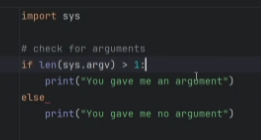
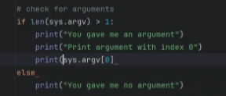

### Quick info
***pycharm is more specific to python and python code, VS code can do it all*** 

add a auto table of contents = "ctrl shift p" to add a command to vsc and search "create table of contents"

- [scripting vs programming](#scripting-vs-programming)
- [Test for argument example:](#test-for-argument-example)


## scripting vs programming 
scripting is a type of programming
scripting specifically:
  - usually simpler
  - usually to automate simple or routine tasks
  - execution is usually done with an interpreter
  - the development cycle is shorter, length of code and etc
     learning curve, it is usually easier to learn than programming


## Test for argument example:
  
- to see what the name of the argument is, include an index
  
 
- index ```[0]``` is the first dirc
- to run a python script you type "python" in a terminal when you've cd into the direc you want to work with (this is the interpreter)
- then the name of the file, this is at index ```[0] ```
- then the arguments from the user is at index ```[1]``` and subsequent argument continue to increase by 1
