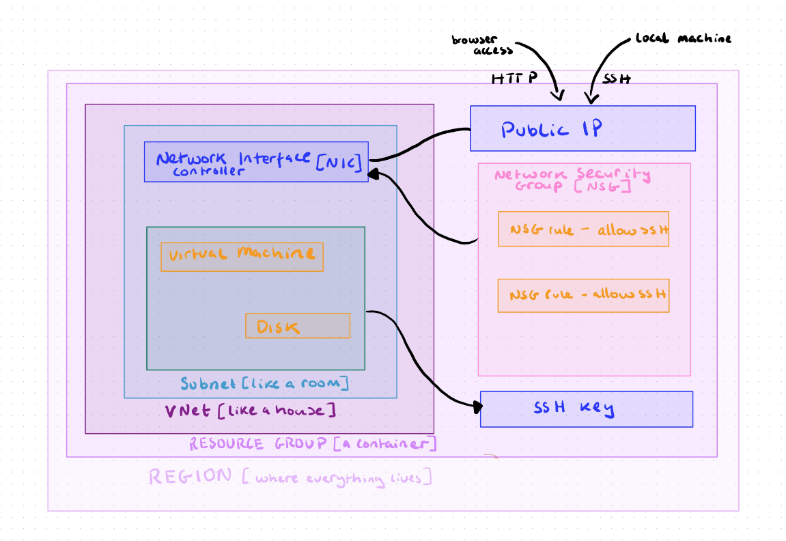
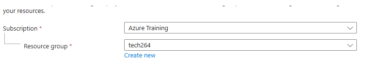
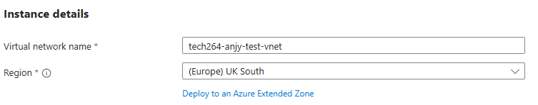
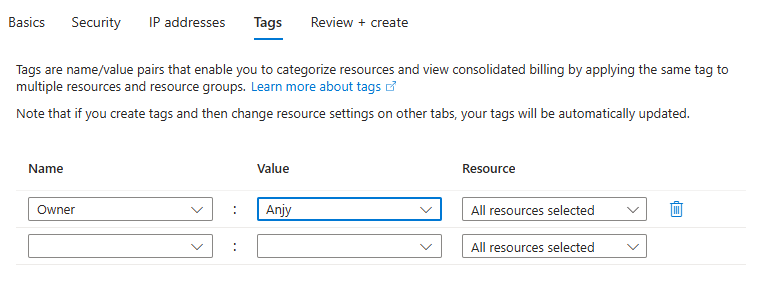
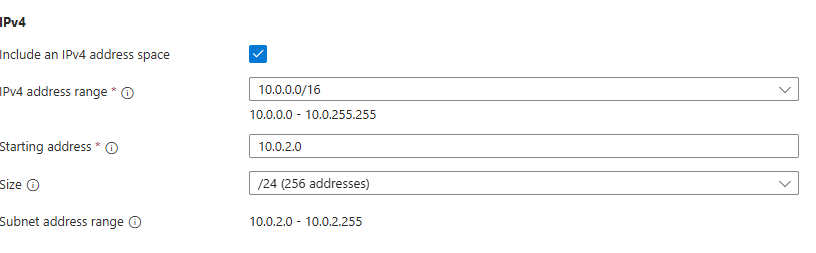
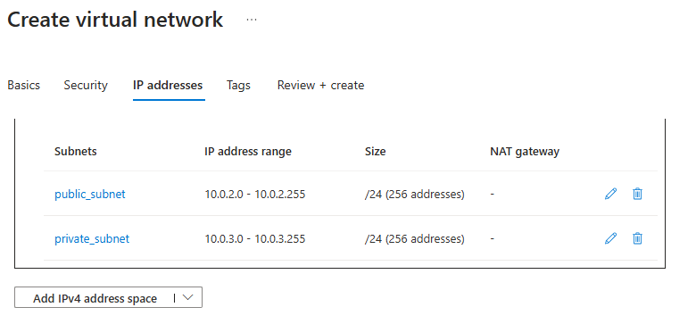

# Scripting  

### Quick info
***pycharm is more specific to python and python code, VS code can do it all*** 

add a auto table of contents = "ctrl shift p" to add a command to vsc and search "create table of contents"

# Table of contents
- [Scripting](#scripting)
    - [Quick info](#quick-info)
  - [scripting vs programming](#scripting-vs-programming)


## scripting vs programming 
scripting is a type of programming
scripting specifically:
  - usually simpler
  - usually to automate simple or routine tasks
  - execution is usually done with an interpreter
  - the development cycle is shorter, length of code and etc
     learning curve, it is usually easier to learn than programming


## Test for argument example:
  
- to see what the name of the argument is, include an index
  
 
- index ```[0]``` is the first dirc
- to run a python script you type "python" in a terminal when you've cd into the direc you want to work with (this is the interpreter)
- then the name of the file, this is at index ```[0] ```
- then the arguments from the user is at index ```[1]``` and subsequent argument continue to increase by 1

## Linux commands
- ```ls```lists the files and direc
- ``` cd``` followed by the name of the direc to open a direc
- ```ls -la``` lists hidden files too
- ``` pwd ``` prints the current working direc
- ``` mkdir``` followed by the name you choose creates a direc
- ``` rmdir``` removes an empty direc
- ```rm``` followed by the name of the file or direc removes them
- ```cp *source* *destination*``` copies files or direc
- ```mv *old_name* *new_name*``` moves ore renames a file or direc
- ```Touch ``` followed by the name you choose creates a empty direc
- ```cat``` followed by the name of the chosen file shows the contents of said file
- ```find -name "*file name*"```  searches for files and direc
- ``` tree``` displays a tree-like structure of direc or files

## Rules for Cloud
- On Azure
  - on make what you are authorized to make
  - Tag everything with a key- pair value "Owner: *first name*"
    - billing is linked to the owner tag
    - in the meta data so you can easier find things and keep them organised
  - Any .pem files (a private key, must be kept private- private keys can also have no extension) must go in your .ssh folder (a hidden folder w all out ssh keys). 
    - Must NEVER be put on a GIT repo- Never GIT initialized.
    - Contains credentials that would allow others to access ur local pc.
  - Use UK south region only
  - Working hours for Azure or AWS is 9-5pm.
    - Must let Ramon know by 4:30 to extend to 6pm.
  - switch off "stop" VMs when not using them after hours.
  - It is your responsibility to remove anything you don't need anymore.

- On AWS
  - Same as above BUT you don't need to tag ownership
  - Choose the ireland region
 
DO NOT EVER EXPOSE YOUR CREDENTIALS:
- GITHUB
- teams screen sharing 
- AWS/Azure
- uploading content to teams
- etc

## Azure VM labelled diagram



## Create an Azure test VNet
1. search "virtual network" on Azure
2. click create
   
4. we only have access to "tech264"
5. name using a naming convention, must have "tech264-anjy"
   
6. put your owner tag as a key
   
7. then review + create
8. when deployment completes
9. it only created on resource but can make more
10. go to resource
11. shows the details of the VNet


# To delete a Azure VNet
1. search resource groups
2. you can see everything in the resource group
3. click into it and select the VNet you want to delete
4. click the three dots to the right at the top and confirm delete, NOT delete resource group


## Make our actual VNet 
- a virtual machine is like a computer but in the cloud - we want to run linux from our local machines
- a VM must fit into a subnet within our VNet
  
- the VNet (tech264-anjy-2-subnet-vnet) CIDR block is 10.0.0.0/16 (gives 65k addresses)
- make two subnets 
  - public (anyone can access)
    - CIDR block 10.0.2.0/24
      -  Represents a range of IP addresses
      -  256 possible addresses in this space
  - private (later will have security) 
    - CIDR block 10.0.3.0/24
-  adjust CIDR blocks
   
-  make sure to change the starting address and only the IPv4
  
- add the owner tag

## Create a ssh key pair
can be done by Azure or AWS but must know manually- used to log into your virtual machine

MUST BE PRIVATE - private "key" on local machine and public "padlock" on azure

1. open git bash
2. be in your home dirc (c/user/aogunwoolu)
3. store ```.ssh``` here
4. ```mkdir .ssh```
5. cd into your ```.ssh`` folder
6. ```ssh-keygen -t rsa -b 4096 -C "your email address"```
   -  -t= type generates a rsa key,
   -  -b = bytes 4096 the bytes of the key
   -  -c = owner
7. hit enter and name it ```tech264-anjy-az-key```
8. hit enter- no pass phrase 
9. also makes a .pub extension, can see when you ls
10. ``` cat tech264-anjy-az-key.pub``` use this command to open the public key
11. print and copy onto azure
12. search ssh keys 
13. name it the same as what it is on the local machine "tech264-anjy-az-key"
14. copy the EXACT key, from first to last charc, must start with "ssh-rsa" and end with your email
15. tag name as owner
16. click create
    
 

